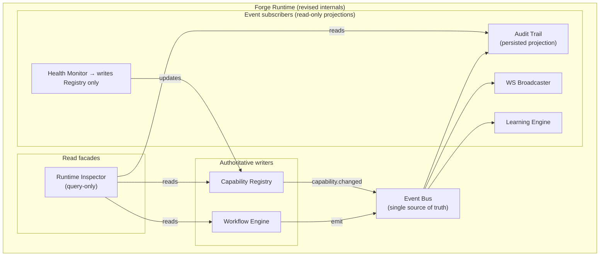
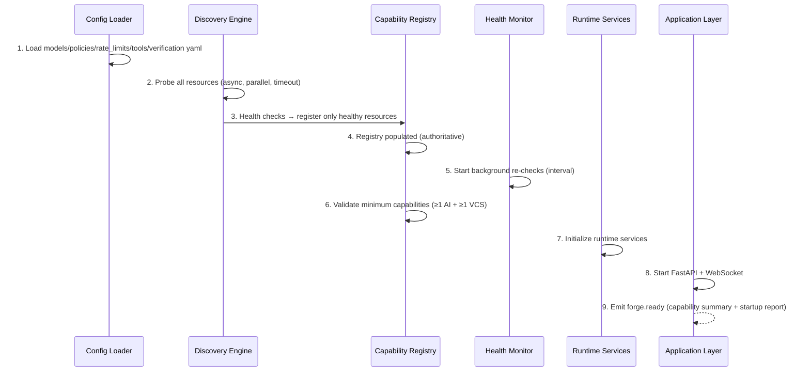
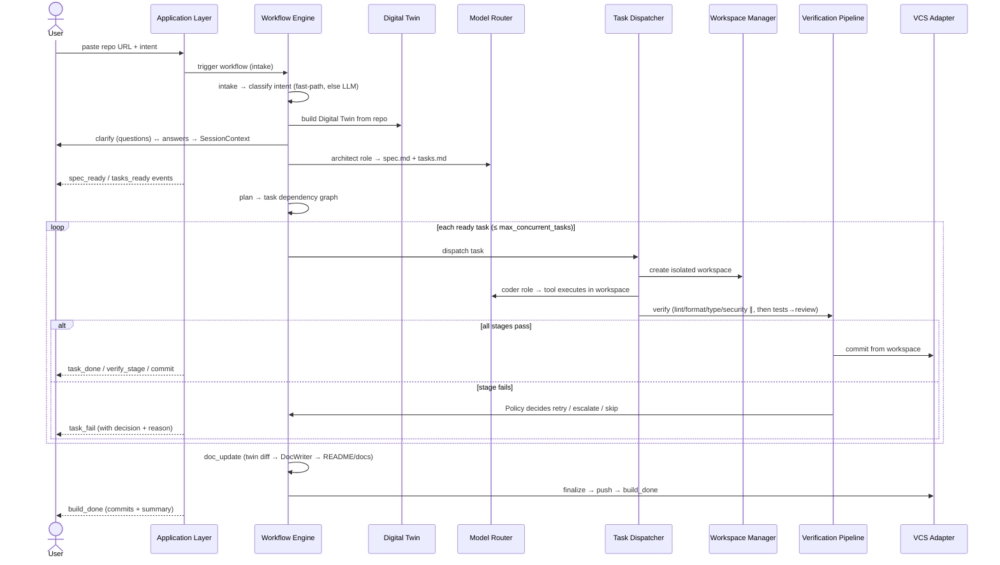
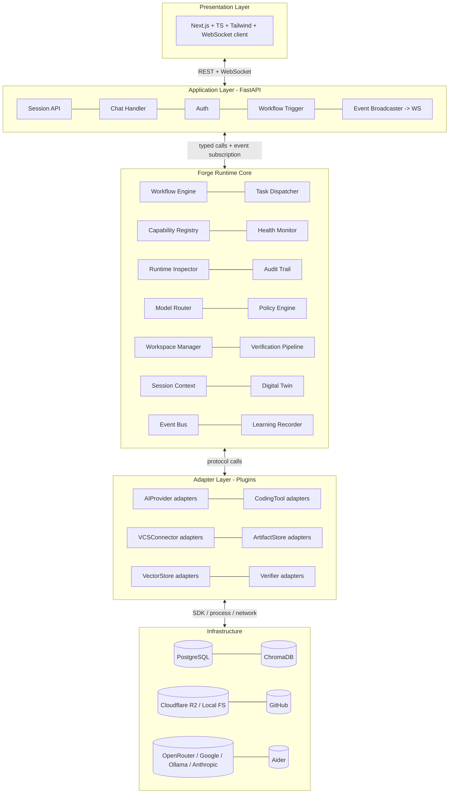
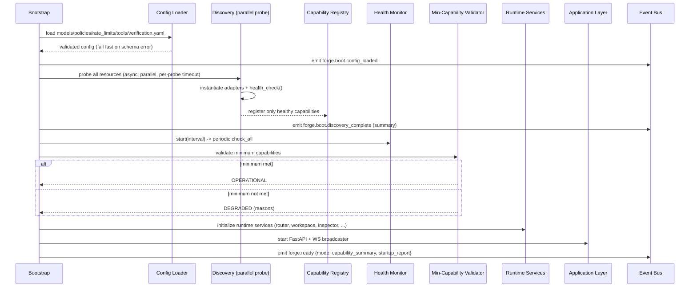
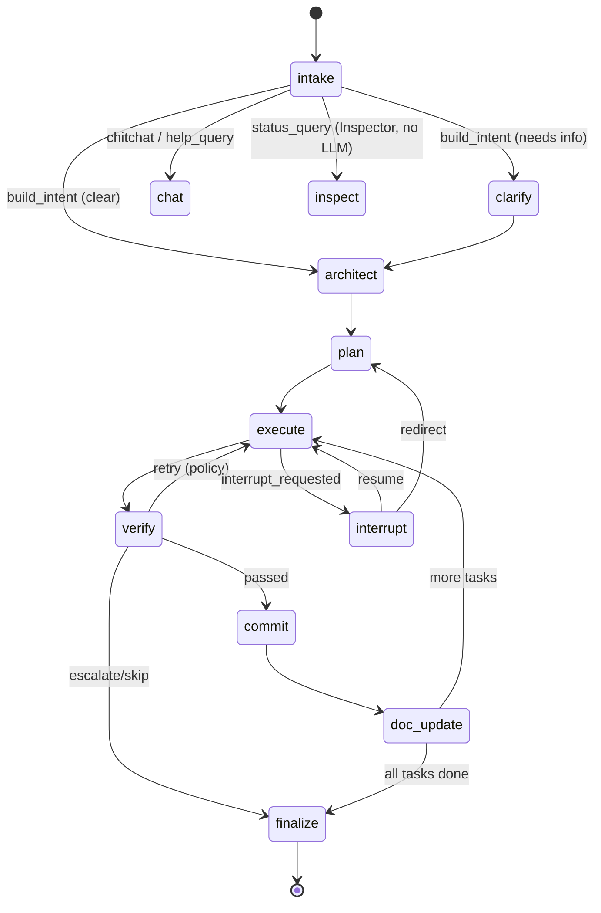

# Design Document: Forge Runtime

## Overview

Forge is an autonomous software engineering runtime. A developer supplies a GitHub repository URL and a plain-English goal; Forge plans, builds, reviews, and commits code into that repository, streaming every decision and artifact back through a chat interface in real time.

This document is structured in three parts, in the order the user asked for:

- **Part I — Architecture Review Report.** A critique of the proposed starting architecture against Forge's six guiding principles, identifying overengineering, underengineering, scalability risks, missing abstractions, and simplification opportunities. Every recommendation states its trade-off.
- **Part II — Revised High-Level Design.** The system as Forge should be built: layers, components, bootstrap, persistence, the event-bus contract, the explainability/audit data model, and degraded-mode behavior.
- **Part III — Low-Level Design.** Plugin protocols, the discovery/registry/health triad, the workspace concurrency model, the Runtime Inspector, the Digital Twin build/sync algorithm, the verification pipeline, the workflow state machine, and the model-router fallback algorithm — with Python signatures and pseudocode.

The product vision and functional requirements are treated as fixed. The *architecture* is treated as a proposal open to revision. Where this design departs from the proposal, the departure and its trade-off are stated explicitly.

### Guiding Principles (the evaluation lens)

Every component below is judged against these. They are also the acceptance lens for the requirements that follow this design.

| Principle | Operational meaning for Forge |
|-----------|-------------------------------|
| **Deterministic** | Same inputs + same config + same recorded model outputs reproduce the same control-flow path. Non-determinism is confined to model/tool calls and is always recorded. |
| **Observable** | Every state transition emits a typed event; runtime state is queryable at any instant. |
| **Modular** | A capability is one file implementing one protocol, registered under one name, with zero edits to existing code. |
| **Replaceable** | Any adapter (AI provider, tool, store, VCS, verifier) can be swapped without touching the runtime core. |
| **Explainable** | Every decision, task, failure, retry, model choice, tool choice, and policy application is answerable from runtime state + the audit trail — never by asking an LLM to guess. |
| **Resilient** | Failures are isolated (sandboxes), retried under policy, and survive process restart via checkpoints. The runtime degrades rather than crashes. |

> Decision rule applied throughout: **do not preserve complexity unless it provides measurable value in the initial build.** Complexity that only pays off in a hypothetical future is deferred behind a stable interface, not built now.

---

## 1. Architecture Review

The proposed architecture is strong: the layering is clean, the plugin-per-domain model is sound, and the explainability-first stance is well-judged. The review below does **not** rewrite it — that would betray the product vision. Instead it identifies specific weaknesses, unnecessary complexity, and missing abstractions, and proposes **targeted, reversible** revisions. Every recommendation is scored against the six principles, and every recommendation that trades one principle for another says so.

### 1.1 Summary of Findings

| # | Finding | Type | Recommendation | Net principle effect |
|---|---------|------|----------------|----------------------|
| R1 | Event bus is the architecture, but no event contract is formalized (schema, versioning, ordering, delivery guarantee) | Missing abstraction | Define a typed `Event` envelope with `schema_version`, monotonic `seq`, and a single `EventBus` protocol with at-least-once in-process semantics | +Observable +Explainable +Replaceable; −Simplicity (small) |
| R2 | Audit trail, event bus, and WebSocket broadcast are three overlapping write paths for "what happened" | Unnecessary complexity / duplication risk | Make the **event bus the single source of truth**; audit trail and WS broadcaster are both *subscribers* (projections) of the same event stream | +Deterministic +Explainable +Observable; −none (removes duplication) |
| R3 | Runtime Inspector and Audit Trail both answer "why," with unclear ownership | Overlap | Inspector becomes a **read-only query facade** over Audit Trail + Capability Registry + live ForgeState. It owns no storage | +Modular +Explainable; −none |
| R4 | `ForgeState` carries `digital_twin`, `audit_log`, and `session_context` inline | Scalability concern | Keep large/growing objects (twin, audit log, vector data) in their stores; `ForgeState` holds **references/handles + small projections**, not the full objects | +Resilient (smaller checkpoints) +Deterministic; −Simplicity (indirection) |
| R5 | Model Router fallback uses fixed sleeps (5→10→20→40s) inside the request path | Resilience/latency concern | Keep the chain, but make backoff a **policy-driven, cancellable** strategy with a circuit breaker per provider so a dead provider is skipped fast, not retried into the timeout | +Resilient +Deterministic; −Simplicity (adds breaker state) |
| R6 | Verification stages run sequentially with `halt` on first failure | Maintainability/throughput | Keep sequential semantics (correctness), but classify stages as `blocking` vs `advisory` and let independent read-only stages (lint, format, type, security) run **concurrently** before the ordered gate (tests → LLM review) | +Resilient (faster feedback); −Determinism of *ordering* of advisory results (mitigated: results are merged deterministically by stage name) |
| R7 | Discovery + Health Monitor + Capability Registry described as three services but coupling is implicit | Modular clarity | Formalize the contract: Discovery *writes* to Registry once; Health Monitor *updates* Registry continuously; everything else *reads* Registry. Registry is the only writable shared state and emits `capability.changed` events | +Modular +Observable +Replaceable; −none |
| R8 | DocWriter / `doc_update` listed but documentation has no model in the twin's lifecycle | Missing first-class treatment | Add `DocumentationState` to the Digital Twin and a **doc-diff** computed at `doc_update` from the twin delta; DocWriter consumes the diff. Documentation becomes a verifiable artifact, not a side effect | +Explainable +Resilient (docs can't silently drift); −Simplicity (small) |
| R9 | Learning Engine observes outcomes but its inputs are the same events as audit | Reuse opportunity | Learning Engine is another **event subscriber**; it never reads raw config or DB tables directly. Recommendations are persisted and surfaced, never auto-applied | +Modular +Explainable; −none |
| R10 | `intake` classification is an LLM call on the hot path of *every* message including "stop" | Resilience/latency | Add a deterministic **fast-path classifier** for interrupts/status/structured commands; fall back to the LLM classifier only for ambiguous natural language | +Resilient +Deterministic +Observable; −Simplicity (two-stage classify) |

### 1.2 Revised Architecture (what changes)

The five layers are **preserved exactly**. The revisions are internal to the Forge Runtime layer and are additive/structural, not a rewrite:



**Key structural changes:**

- **R2 + R3 + R9 unified principle:** *one event stream, many projections.* The event bus is the spine. The audit trail, WebSocket broadcaster, and learning engine are subscribers. The Runtime Inspector is a query facade that owns no storage. This removes three competing "what happened" write paths and guarantees that what the user sees (WS), what is explained (audit), and what is learned from (learning) are derived from the **same ordered event sequence** — which is exactly what makes explainability trustworthy.

- **R7 capability-state contract:** Discovery writes the Registry once at boot; Health Monitor is the only continuous writer; every other subsystem reads. The Registry emits `capability.changed`, so the Model Router reacts to a provider going down without polling.

- **R1 event envelope:** a single typed envelope with `schema_version` and a monotonic per-session `seq` makes the stream replayable and ordered — the precondition for deterministic projections and for Resume Mode.

### 1.3 Trade-offs Explicitly Documented

- **R4 (state slimming):** Improves **Resilient** (checkpoints are small and cheap to write every 30s) and **Deterministic** (state diffs are stable), at the cost of **Simplicity** — code must dereference handles to the twin/audit stores. *Decision: accept.* The alternative (fat checkpoints) makes the 30s checkpoint interval expensive and risks partial writes, directly harming Resilience, which ranks higher here.

- **R5 (circuit breaker):** Improves **Resilient** (a dead provider is ejected in milliseconds instead of after a 40s backoff ladder) but adds breaker state, slightly reducing **Simplicity** and introducing a parameter (breaker reset window) that must itself be observable. *Decision: accept,* and make the breaker state queryable via the Inspector so it remains **Explainable**.

- **R6 (concurrent advisory stages):** Improves throughput/feedback latency (a facet of **Resilient**/UX) but the *arrival order* of advisory results becomes non-deterministic. *Mitigation:* results are keyed and merged by stage name into a deterministic `VerificationResult` map, so the **observed outcome** is deterministic even though wall-clock arrival is not. The ordered gate (tests → LLM review → commit) stays strictly sequential because correctness depends on it. *Decision: accept with mitigation.*

- **R10 (two-stage intake):** Improves **Deterministic** and **Resilient** (a "stop" command never depends on an LLM being reachable) at a small **Simplicity** cost (a rules table plus the LLM classifier). *Decision: accept* — interrupt/stop reliability is non-negotiable in an autonomous runtime.

- **Principle not improved:** none of the recommendations reduce **Modular**, **Replaceable**, **Observable**, or **Explainable**. The only principle ever traded down is **Simplicity**, and only in small, contained ways. This matches the guidance: *prefer the simpler design unless it reduces modularity, extensibility, observability, or correctness.*

### 1.4 What Was Deliberately Left Unchanged

- The **five-layer model** and the **plugin-per-domain** decomposition — they are the product's spine and already satisfy all six principles.
- The **LangGraph workflow** node set — it maps cleanly to the user journey and is config-driven.
- The **Workspace Manager** sandbox model — isolated workspaces are exactly what makes retries/rollback/parallelism safe.
- The **role-based Model Router** — decoupling roles from providers is the right abstraction; only its retry mechanics are revised (R5).
---

# Part I — Architecture Review Report

## I.1 Review methodology

The proposed architecture is strong: a clean five-layer separation, a plugin-everywhere philosophy, an event-driven core, and explainability as a first-class concern. These are the right bones. The risk is not that it is wrong — it is that it is *too much for the first build*. Roughly a third of the named subsystems deliver their value only after Forge is already running reliably at scale. Building them now spends determinism and resilience budget (more moving parts, more failure modes, more to test) to buy capabilities no early user exercises.

The review classifies each subsystem into one of four verdicts:

- **Keep** — justified now; build as proposed (possibly tightened).
- **Simplify** — keep the responsibility, cut the scope; build a lean version behind the full interface.
- **Defer** — valuable later; build the interface/seam now, implement a trivial or no-op version, schedule the real one post-MVP.
- **Add** — missing from the proposal; required for the principles to actually hold.

## I.2 What the proposal gets right (Keep)

- **Layered isolation with adjacent-only communication.** Directly serves *modular* and *replaceable*. Keep the rule, but enforce it mechanically (import-linter contract in CI), otherwise it erodes. *Trade-off: a CI gate adds friction to refactors; worth it to keep the boundary real.*
- **Plugin protocols for adapters (AI/Tool/Store/VCS/Verifier).** This is the core bet and it is correct. Keep all five protocols. They are the seams that make everything else replaceable.
- **Discovery → Registry → Health as three responsibilities.** Genuinely distinct (find / record / monitor). Keep the separation. (One refinement in I.4.)
- **Model Router that knows roles, not providers, with per-role fallback chains.** This is the heart of *explainable* model selection. Keep in full — it is one of the few places where extra structure pays for itself immediately.
- **Workspace isolation (sandboxed repo copy per task).** Directly serves *resilient* (safe retry, rollback) and *deterministic* (no cross-task contamination). Keep isolation. (Concurrency scope cut — see I.3.)
- **Runtime Inspector answering from state + audit, never from an LLM.** This is the load-bearing wall of explainability. Keep in full.
- **Typed event bus as the only inter-component channel.** Keep the contract. (Distributed transport deferred — see I.3.)
- **ForgeState as a single typed state object.** Keep — it is what makes the workflow inspectable and checkpointable.

## I.3 Overengineering — Simplify or Defer (with trade-offs)

### Learning Engine → **Defer**
Recording outcomes is cheap and valuable; *analyzing* them into policy recommendations is a product in its own right and exercises no early user need. **Build `record_outcome` now** (it is just an audit write) and **defer `analyze` / `global_patterns`**.
*Trade-off:* Forge will not surface "you keep rejecting SQLAlchemy, want a standing policy?" suggestions in v1. Mitigated because all data is captured from day one, so the analyzer can be added later with full history and zero schema migration.

### Distributed event bus → **Defer (keep contract, in-process only)**
"In-process today, distributed tomorrow" is a YAGNI trap if the distributed transport is designed now. The *contract* (typed envelope, publish/subscribe) must be stable; the *transport* should be a single in-process async implementation.
*Trade-off:* horizontal scale-out across machines is not available in v1. Mitigated because the bus interface is unchanged when a Redis/NATS transport is swapped in later — only one adapter file is added.

### Repository Digital Twin → **Simplify**
The full twin (dependency graph, API-surface extraction, test-coverage map, doc-state model) is a static-analysis platform. For the first build, the runtime needs: language/framework detection, a file index with roles (entry points, tests, config), and a git summary. Dependency graph and API surface are **deferred**.
*Trade-off:* `affected_by` / `dependents_of` become heuristic (path- and import-grep based) rather than precise. Acceptable: the verification pipeline (tests) is the real safety net; the twin only needs to be good enough to scope context and prompts. The full twin slots in behind the same interface later.

### Coding tools (Aider **and** OpenHands) → **Simplify to one**
Two coding-tool integrations double the tool-adapter surface and the verification matrix before either is proven. Ship one (Aider — lighter, more deterministic invocation), keep `OpenHands` as a registered-but-unhealthy capability stub.
*Trade-off:* less tool diversity / fallback in v1. Mitigated by the `CodingTool` protocol — adding OpenHands later is one file.

### VectorStore / ChromaDB retrieval → **Simplify (pluggable, trivial default)**
Semantic retrieval is valuable but not on the critical path for correctness; tests are. Keep the `VectorStore` protocol and ChromaDB adapter, but make the default context provider degrade gracefully to lexical retrieval if the vector store is unhealthy.
*Trade-off:* slightly weaker context selection when Chroma is down, rather than a hard failure. Serves *resilient*.

### StateStore as a plugin over PostgreSQL → **Simplify (do not abstract the relational core)**
PostgreSQL is a hard, assumed dependency for sessions/tasks/audit. Hiding it behind a swappable `StateStore` plugin adds indirection that buys nothing — there is no second relational store on the roadmap, and audit queries want SQL. **Keep the relational store concrete** (a repository/DAO layer, not a runtime plugin). Keep pluggability only where a second implementation is realistic: the **Artifact Store** (R2 ↔ local) genuinely has two backends, so that stays a plugin.
*Trade-off:* swapping Postgres for another relational DB later means editing the DAO layer, not registering a plugin. This is the right cost: abstractions should be earned by a second real implementation, and there is none here.

### Policy Engine → **Simplify**
Do not build a policy DSL. The only decisions needed now are: on verification failure → `retry | escalate | skip`, bounded by a retry budget. Implement as a small rules object driven by `policies.yaml`, not an interpreter.
*Trade-off:* complex conditional policies aren't expressible in v1. The `PolicyEngine.decide(...)` interface is stable, so a richer engine drops in later.

### "Discovery Engine" as a long-lived service → **Simplify to a bootstrap procedure + the Health Monitor**
Discovery is a *startup-time* activity (probe everything once, in parallel). Continuous monitoring is the Health Monitor's job. A standing "Discovery Engine" service blurs that. Keep discovery as a bootstrap function that the Health Monitor can re-invoke for a single resource on recovery attempts.
*Trade-off:* none meaningful; this is a clarification that reduces a component without losing a responsibility.

## I.4 Underengineering — Add (missing pieces the principles require)

The proposal under-specifies several things that the six principles *demand*. These are additions, not nice-to-haves.

1. **Event envelope with ordering & causality.** "Typed events" is not enough for explainability. Each event needs `event_id`, `seq` (monotonic per session), `ts`, `correlation_id` (session), `causation_id` (the event that triggered it), `source`, and a typed `payload`. Without causation links, the Inspector can show *what* happened but not *why this followed that*. **Added** in II.5.

2. **Concrete audit-trail schema.** The Inspector's `explain_*` methods are only as good as the records behind them. The proposal names an `audit_log` table but no schema. **Added** in II.6 — a typed `DecisionRecord` is the unit of explainability.

3. **Secret handling & redaction.** `vcs_token` flows through `ForgeState`, prompts, and (dangerously) could land in audit logs and prompt-response artifacts. Sandboxes execute model-generated code with repo write access. The proposal is silent. **Added**: tokens are never persisted in state snapshots or audit records (stored only in a per-session secret holder, redacted on serialization); sandboxes run with no ambient credentials and a network/egress policy. See II.8 and Security Considerations.

4. **Crash recovery / resumability.** Checkpoints are mentioned but the *recovery path* is not. A runtime that claims *resilient* must resume an interrupted build from its last checkpoint after a process restart. **Added** in III.8 (workflow checkpointing + resume).

5. **Backpressure on streaming.** Token streams and per-task events can outpace a slow WebSocket client. Unbounded queues = memory blow-up. **Added**: bounded per-subscriber queues with a drop-oldest-non-critical policy; `token` events are coalescible, lifecycle events (`task_done`, `build_done`) are never dropped. See II.5.

6. **Cost / rate-limit governance.** `rate_limits.yaml` is named but enforcement is undefined. **Added**: a per-session token/cost budget enforced at the Model Router, surfaced via the Inspector, and an input to policy escalation.

7. **Minimum-capability contract is binary; degraded mode is under-defined.** "≥1 AI provider + ≥1 VCS" gates *operation*, but which *roles* must resolve? A build needs at least a Coder and a Reviewer role to mean anything. **Refined** in II.7.

## I.5 Scalability assessment

- **Single-process asyncio core is correct for v1.** Concurrency is I/O-bound (model calls, git, subprocesses). The bottlenecks are external providers and disk, not CPU. *Trade-off:* a single process caps throughput; this is fine until there are many concurrent sessions, at which point the deferred distributed bus + a worker pool across processes is the growth path — already seam-compatible.
- **Workspace storage growth** is the real near-term scale risk (a repo copy per task). Mitigation: workspaces are ephemeral, destroyed on task completion/merge, with a reaper for orphans and a disk high-water policy that forces sequential execution. **Added** to Workspace Manager.
- **Blocking work (git, subprocess, lint/test runners) must not block the event loop.** All such calls run in a bounded thread/process executor. **Added** to the concurrency model (III.4).

## I.6 Verdict summary

| Subsystem | Verdict | Rationale (one line) |
|-----------|---------|----------------------|
| Five-layer architecture + adjacency rule | **Keep** | Core of modular/replaceable; enforce in CI |
| Adapter plugin protocols (AI/Tool/Store/VCS/Verifier) | **Keep** | The seams everything depends on |
| Capability Registry + Health Monitor | **Keep** | Distinct, justified |
| Discovery Engine (standing service) | **Simplify** | Make it a bootstrap procedure + health re-probe |
| Model Router (roles + fallback) | **Keep** | Heart of explainable model selection |
| Workspace isolation | **Keep** | Resilience + determinism |
| Workspace *parallelism* | **Defer** | Build seam, run sequentially in v1 |
| Runtime Inspector | **Keep** | Load-bearing wall of explainability |
| Typed event bus (contract) | **Keep** | Only inter-component channel |
| Distributed event transport | **Defer** | Keep contract, in-process only |
| ForgeState + LangGraph workflow | **Keep** | Inspectable, checkpointable |
| Verification Pipeline | **Keep** | The real correctness safety net |
| Repository Digital Twin (full) | **Simplify** | Lean twin now; dep-graph/API-surface later |
| Learning Engine (record) | **Keep** | Cheap audit write |
| Learning Engine (analyze/recommend) | **Defer** | A product unto itself; data captured now |
| Policy Engine (DSL) | **Simplify** | Small rules object from YAML |
| Two coding tools | **Simplify** | Ship one; second is one file later |
| VectorStore/Chroma | **Simplify** | Pluggable, lexical fallback |
| StateStore plugin over Postgres | **Simplify** | Keep relational core concrete (DAO) |
| Artifact Store plugin (R2/local) | **Keep** | Two real backends justify the seam |
| Event envelope (seq/causation) | **Add** | Required for "why", not just "what" |
| Audit/DecisionRecord schema | **Add** | Backs every `explain_*` |
| Secret redaction + sandbox egress policy | **Add** | Security gap |
| Crash recovery / resume | **Add** | Required for "resilient" |
| Streaming backpressure | **Add** | Prevents memory blow-up |
| Cost/rate budget enforcement | **Add** | Makes rate_limits.yaml real |

**Net effect:** the revised v1 has *fewer running parts* than the proposal (no standing Discovery service, no distributed bus, one coding tool, lean twin, no policy interpreter, no recommendation analyzer, no StateStore indirection) but is *more faithful to the principles* (causal events, concrete audit schema, secret handling, crash recovery, backpressure). Every deferred item keeps its interface, so re-expanding is additive, not a rewrite.

---

## 2. High-Level Design

## Architecture

### 2.1 Layered Architecture

Five layers. No layer reaches across two levels; each communicates only with adjacent layers through defined interfaces.

```mermaid
graph TD
    subgraph L1["1 · Presentation Layer"]
        UI["Web UI (Next.js/TS)"]
        CLI["Future: CLI / Desktop / IDE"]
    end
    subgraph L2["2 · Application Layer (FastAPI)"]
        SESS["Session Mgmt"]
        CHAT["Chat Handler"]
        AUTH["Auth"]
        TRIG["Workflow Trigger"]
        CAST["Event Broadcaster (WS)"]
    end
    subgraph L3["3 · Forge Runtime"]
        WF["Workflow Engine"]
        REG["Capability Registry"]
        INSP["Runtime Inspector"]
        DISC["Discovery Engine"]
        HM["Health Monitor"]
        LEARN["Learning Engine"]
        POL["Policy Engine"]
        WSM["Workspace Manager"]
        SCTX["Session Context"]
        BUS["Event Bus"]
        ROUTER["Model Router"]
        DISP["Task Dispatcher"]
        VERIFY["Verification Pipeline"]
        AUDIT["Audit Trail"]
        TWIN["Digital Twin"]
    end
    subgraph L4["4 · Adapter Layer"]
        AIA["AI Provider Adapters"]
        CTA["Coding Tool Adapters"]
        VCSA["VCS Adapters"]
        STA["Storage Adapters"]
        VECA["Vector Adapters"]
        VERA["Verifier Adapters"]
        DOCA["DocWriter Adapters"]
    end
    subgraph L5["5 · Infrastructure Layer"]
        PG["PostgreSQL"]
        CHROMA["ChromaDB"]
        R2["Cloudflare R2 / Local FS"]
        GH["GitHub"]
        OH["OpenHands"]
        AID["Aider"]
        OR["OpenRouter"]
        GOOG["Google / Ollama / Anthropic"]
    end

    L1 <--> L2
    L2 <--> L3
    L3 --> L4
    L4 --> L5
```



**Separation-of-concerns contract (enforced by review and tests):**
- Presentation knows nothing about models, tools, or orchestration — only the runtime API + event types.
- Application knows nothing about *how* work is done — it creates sessions, forwards messages, broadcasts events.
- Runtime knows nothing about HTTP — it consumes/produces typed events and depends only on `Protocol` interfaces.
- Adapters know nothing about business logic — they translate a `Protocol` call into an infrastructure call.

## Components and Interfaces

### 2.2 Runtime Services (component responsibilities)

| Service | Single responsibility | Writes | Reads |
|---------|----------------------|--------|-------|
| **Discovery Engine** | Probe configured resources at boot / on manual rescan | Registry (once) | config files |
| **Capability Registry** | Authoritative source of truth for *what is available now* | itself | — |
| **Health Monitor** | Continuously re-check resources; flip availability | Registry | adapters' `health_check()` |
| **Event Bus** | Ordered, typed delivery of all runtime events | — (transport) | — |
| **Workflow Engine** | Drive the LangGraph state machine | ForgeState, emits events | Registry, Twin, Context |
| **Task Dispatcher** | Assign tasks to workers + workspaces respecting parallelism policy | ForgeState | Policy, Registry, WSM |
| **Workspace Manager** | Create/destroy/merge isolated repo sandboxes | filesystem workspaces | Policy |
| **Model Router** | Resolve a *role* to a healthy provider+model with fallback | emits routing events | Registry, Policy |
| **Verification Pipeline** | Run ordered/advisory verifier stages on task output | VerificationResult | Registry (verifiers), Policy |
| **Policy Engine** | Decide retry / escalate / skip / approval from config | — | policies.yaml |
| **Session Context** | Persistent working memory (goals, decisions, constraints) | session_context store | — |
| **Digital Twin** | Structured model of the repo incl. doc state | twin store | VCS, Vector, repo |
| **Audit Trail** | Persisted projection of the event stream | audit_log | Event Bus |
| **Runtime Inspector** | Query-only "what/why" facade (no LLM) | — | Audit, Registry, ForgeState |
| **Learning Engine** | Observe outcomes, surface (never apply) recommendations | learning_outcomes | Event Bus |

### 2.3 Event Contract (the spine)

Every runtime occurrence is an `Event` on the bus. The contract — not any one component — *is* the architecture, so it is formalized first.

```python
class Event(BaseModel):
    schema_version: int          # bumped on breaking payload change
    seq: int                     # monotonic per session; defines ordering & replay
    session_id: str
    type: EventType              # closed enum (see WebSocket event types below)
    timestamp: datetime          # UTC
    source: str                  # emitting component, e.g. "model_router"
    payload: dict                # type-specific, schema documented per EventType
    causation_id: str | None     # event that caused this one (explainability)
    correlation_id: str | None   # groups events of one logical operation (e.g. a task)
```

**Delivery semantics (in-process today, distributed tomorrow):** at-least-once, ordered per `session_id` by `seq`. Subscribers are idempotent on `(session_id, seq)`. The same envelope crosses a network boundary unchanged when the bus becomes distributed — which is why the contract, not the transport, is the architecture.

**WebSocket / runtime event types** (closed enum; each has a documented payload):

| EventType | Payload (key fields) |
|-----------|----------------------|
| `token` | `text`, `role` (streamed model output) |
| `task_start` | `task_id`, `tool`, `workspace_id` |
| `task_done` | `task_id`, `duration_ms` |
| `task_fail` | `task_id`, `stage`, `reason`, `decision` (retry/escalate/skip) |
| `verify_stage` | `task_id`, `stage`, `status`, `details` |
| `spec_ready` | `spec_uri`, `version` |
| `tasks_ready` | `task_count`, `graph_summary` |
| `question` | `question_id`, `text` (clarification) |
| `build_done` | `session_id`, `commits[]`, `summary` |
| `error` | `code`, `message`, `recoverable` |
| `capability_update` | `capability`, `status`, `reason` |
| `recommendation` | `id`, `text`, `evidence` |
| `workspace_created` | `workspace_id`, `task_id`, `path` |
| `doc_updated` | `files[]`, `twin_diff_summary` |

## Data Models

### 2.4 Core Data Models

```python
class Capability(str, Enum):
    AI_CLARIFICATION = "ai_clarification"; AI_ARCHITECT = "ai_architect"
    AI_PLANNER = "ai_planner"; AI_CODER = "ai_coder"; AI_REVIEWER = "ai_reviewer"
    AI_DOC_WRITER = "ai_doc_writer"; AI_INTERRUPT_HANDLER = "ai_interrupt_handler"
    TOOL_AIDER = "tool_aider"; TOOL_OPENHANDS = "tool_openhands"
    VCS_GITHUB = "vcs_github"; STORE_R2 = "store_r2"; STORE_LOCAL = "store_local"
    DB_POSTGRES = "db_postgres"; VECTOR_CHROMA = "vector_chroma"; RUNTIME_DOCKER = "runtime_docker"

class CapabilitySummary(BaseModel):
    available: dict[Capability, "HealthStatus"]
    degraded: list[Capability]
    missing_required: list[Capability]
    can_operate: bool            # ≥1 AI provider AND ≥1 VCS connector

class Task(BaseModel):
    id: str; title: str; description: str
    depends_on: list[str]
    target_files: list[str]
    status: Literal["pending","running","verifying","committed","failed","skipped"]
    attempts: int = 0
    assigned_tool: Capability | None = None
    workspace_id: str | None = None

class DigitalTwin(BaseModel):
    language: str; framework: str
    architecture: "ArchitectureMap"; dependencies: "DependencyGraph"
    api_surface: "APISurface"; test_map: "TestCoverageMap"
    doc_state: "DocumentationState"          # first-class (R8)
    git_summary: str; entry_points: list[str]; active_files: list[str]

class DocumentationState(BaseModel):
    doc_files: dict[str, "DocFileModel"]     # path -> {sections, code_refs, last_synced_sha}
    readme_present: bool
    coverage: dict[str, bool]                # module -> documented?
    drift: list["DocDrift"]                  # code changed but doc didn't
```

`ForgeState` is the LangGraph TypedDict. Per **R4**, large objects are referenced, not embedded:

```python
class ForgeState(TypedDict):
    session_id: str; repo_url: str; vcs_token: str
    user_intent: str; intent_class: "IntentClass"
    clarification_qa: list[dict]
    session_context: "SessionContext"          # small, working memory
    spec_uri: str | None                        # R4: artifact handle, not blob
    tasks: list[Task]; task_graph: dict
    completed_tasks: list[str]; failed_tasks: list[str]
    current_task: str | None
    active_workspaces: list[str]
    verification_results: dict[str, "VerificationResult"]
    checkpoint_seq: int                         # R4: audit log referenced by seq, not embedded
    interrupt_requested: bool; interrupt_message: str | None
    build_mode: Literal["new","extend","analyze","document"]
    twin_ref: str                               # R4: handle into twin store
    capabilities: CapabilitySummary
```

### 2.5 Startup / Bootstrapping Sequence

Deterministic and fully observable — every step emits an event and is logged.



If minimum capabilities are not met, Forge enters **degraded mode**: it still starts, emits `forge.ready` with `can_operate=false`, and the UI shows exactly which capabilities are missing and which features are unavailable. (Resilient + Observable: the runtime never silently fails to start.)

### 2.6 Primary Data Flow (build journey)


---

# Part II — Revised High-Level Design

## II.1 Core philosophy

**The runtime is the product; the web UI is one client.** Everything outside the runtime core is a plugin discovered at startup. Capabilities are *discovered, not assumed*. The runtime communicates exclusively through typed events on an in-process event bus. Adding a capability means creating one file, implementing one protocol, and registering one name — with zero edits to existing code.

## II.2 Layered architecture

Five layers, adjacent-communication only. The rule is enforced in CI by an import contract (no module may import from a layer two or more levels away).



**Layer responsibilities**

- **Presentation** — renders chat, spec, task checklist, verification stages, commit log, progress. Holds no business logic. Consumes events over WebSocket.
- **Application (FastAPI)** — HTTP/WebSocket boundary: session CRUD, message ingestion, auth, triggering the workflow, and broadcasting runtime events to clients. Translates between transport and the runtime; contains no engineering logic.
- **Forge Runtime Core** — the product. Orchestrates builds, owns all state, emits all events, makes and records all decisions.
- **Adapter Layer** — concrete implementations of the plugin protocols. The only code that knows about a specific provider, tool, store, or VCS.
- **Infrastructure** — external systems and processes.

## II.3 Component catalog (revised)

| Component | Layer | Verdict from review | Role |
|-----------|-------|---------------------|------|
| Workflow Engine | Core | Keep | LangGraph state machine over `ForgeState` |
| Task Dispatcher | Core | Keep | Hands tasks to workers in isolated workspaces |
| Capability Registry | Core | Keep | Records healthy capabilities; resolves by name/role |
| Health Monitor | Core | Keep | Periodic re-probe; degrade/recover transitions |
| Bootstrap (discovery) | Core | Simplify | Startup procedure that probes resources in parallel |
| Model Router | Core | Keep | Resolves role → healthy provider with fallback |
| Policy Engine | Core | Simplify | YAML-driven retry/escalate/skip decisions |
| Workspace Manager | Core | Keep (seq) | Per-task sandboxed repo copies |
| Verification Pipeline | Core | Keep | Staged verifier plugins |
| Session Context | Core | Keep | Persistent per-session working memory |
| Digital Twin | Core | Simplify | Lean structural model of the repo |
| Runtime Inspector | Core | Keep | Answers what/why from state + audit |
| Audit Trail | Core | Keep (+schema) | Append-only `DecisionRecord` store |
| Event Bus | Core | Keep (in-proc) | Typed pub/sub, the only inter-component channel |
| Learning Recorder | Core | Keep (record only) | Writes outcomes to audit/`learning_outcomes` |
| AI/Tool/VCS/Store/Vector/Verifier adapters | Adapter | Keep | Protocol implementations |

## II.4 Startup bootstrap (deterministic, observable, every step logged)



Determinism notes: config schema validation fails fast (no partial boot). Discovery is parallel but its *result* — the set of healthy capabilities — is recorded verbatim in the startup report, so a boot is fully explainable after the fact ("CHROMA was unhealthy at 12:03:11 because connect timed out").

## II.5 Event bus contract & typed event catalog

The bus is the only channel between core components and the only source the Application layer broadcasts from. It is in-process (asyncio) in v1; the contract below is transport-independent.

### Event envelope

```python
from typing import Protocol, Callable, Awaitable, Any
from dataclasses import dataclass, field
from datetime import datetime, timezone
import uuid

@dataclass(frozen=True)
class Event:
    type: str                          # dotted name, e.g. "task.done"
    payload: dict[str, Any]            # typed per-type (see catalog); secrets pre-redacted
    correlation_id: str               # session_id — groups all events of a build
    causation_id: str | None = None   # event_id that caused this one (the "why" link)
    source: str = "runtime"           # component that emitted it
    seq: int = 0                       # monotonic per correlation_id (assigned by bus)
    event_id: str = field(default_factory=lambda: str(uuid.uuid4()))
    ts: datetime = field(default_factory=lambda: datetime.now(timezone.utc))

EventHandler = Callable[[Event], Awaitable[None]]

class EventBus(Protocol):
    async def publish(self, event: Event) -> Event: ...          # returns envelope w/ assigned seq
    def subscribe(self, pattern: str, handler: EventHandler) -> "Subscription": ...
    async def replay(self, correlation_id: str, since_seq: int = 0) -> list[Event]: ...
```

- `seq` is assigned by the bus under a per-`correlation_id` lock, giving a total order per session — the backbone of deterministic replay and Inspector timelines.
- `causation_id` makes the trail a causal graph, not a flat log. "Why did `commit.start` fire?" → follow `causation_id` back to `verify.passed` ← `task.done` ← `task.start` ← `plan.ready`.
- **Backpressure:** each subscriber has a bounded queue. Lifecycle events (`*.start`, `*.done`, `*.fail`, `build.done`, `question`, `error`) are *durable* (never dropped, block briefly then persist). `token` events are *coalescible* (drop-oldest under pressure) since the full text is also persisted to the prompt-response artifact.

### Typed event catalog

Internal runtime events (subset; payload fields shown):

| Type | Payload | Emitted by |
|------|---------|-----------|
| `forge.boot.config_loaded` | `{files, checksum}` | Bootstrap |
| `forge.boot.discovery_complete` | `{healthy[], unhealthy[]}` | Bootstrap |
| `forge.ready` | `{mode, capability_summary, startup_report}` | Bootstrap |
| `capability.registered` / `capability.deregistered` | `{name, kind}` | Registry |
| `capability.degraded` / `capability.recovered` | `{name, reason}` | Health Monitor |
| `intent.classified` | `{intent_class, confidence, model}` | intake node |
| `clarify.question` / `clarify.answer` | `{question}` / `{answer}` | clarify node |
| `spec.ready` | `{spec_uri, version}` | architect node |
| `tasks.ready` | `{count, graph_uri}` | plan node |
| `task.start` / `task.done` / `task.fail` | `{task_id, workspace_id, reason?}` | dispatcher/workers |
| `verify.stage` | `{task_id, stage, status, detail}` | verification pipeline |
| `verify.passed` / `verify.failed` | `{task_id, failed_stage?}` | verification pipeline |
| `policy.decision` | `{subject, decision, rule, inputs}` | Policy Engine |
| `model.selected` | `{role, provider, model, attempt, reason}` | Model Router |
| `model.fallback` | `{role, from, to, error}` | Model Router |
| `workspace.created` / `workspace.merged` / `workspace.destroyed` | `{workspace_id, task_id}` | Workspace Mgr |
| `commit.done` | `{task_id, sha, files[]}` | commit node |
| `build.done` | `{summary, committed[], skipped[]}` | finalize node |
| `interrupt.requested` / `interrupt.resumed` | `{message?}` | interrupt node |
| `error` | `{where, error_type, message, recoverable}` | any component |

WebSocket events broadcast to the client (mapped 1:1 or aggregated from internal events): `token`, `task_start`, `task_done`, `task_fail`, `verify_stage`, `spec_ready`, `tasks_ready`, `question`, `build_done`, `error`, `capability_update`, `recommendation`, `workspace_created`.

## II.6 Explainability & audit-trail data model

Explainability is backed by two stores that the Runtime Inspector reads — **never** an LLM:

1. **Event log** (per session, ordered by `seq`) — the *what-happened-when* timeline, persisted from the bus.
2. **DecisionRecord audit trail** — the *why* behind every non-trivial choice.

```python
from enum import Enum

class DecisionKind(str, Enum):
    INTENT_CLASSIFICATION = "intent_classification"
    CLARIFICATION = "clarification"
    MODEL_SELECTION = "model_selection"
    TOOL_SELECTION = "tool_selection"
    POLICY_APPLICATION = "policy_application"
    VERIFICATION_OUTCOME = "verification_outcome"
    RETRY = "retry"
    CAPABILITY_TRANSITION = "capability_transition"
    TASK_OUTCOME = "task_outcome"

@dataclass(frozen=True)
class DecisionRecord:
    decision_id: str
    session_id: str
    kind: DecisionKind
    subject: str                 # what the decision is about (task_id, role, capability, ...)
    inputs: dict[str, Any]       # the facts considered (health states, budgets, config rule id)
    decision: str                # the choice made
    rationale: str               # deterministic, template-built from inputs (NOT model prose)
    alternatives: list[str]      # what else was available and not chosen
    caused_by_event_id: str | None
    ts: datetime
```

Key property: `rationale` is **constructed from `inputs` by the runtime**, e.g. `"selected provider=openrouter/anthropic for role=CODER because primary=google was DEGRADED (timeout at 12:03) and this is fallback #1; session budget 41k/200k tokens within limit"`. It is reproducible from the record's own fields. This is what lets the Inspector answer "why" truthfully.

Persistence: `audit_log(decision_id PK, session_id, kind, subject, inputs JSONB, decision, rationale, alternatives JSONB, caused_by_event_id, ts)` plus `event_log(event_id PK, session_id, seq, type, payload JSONB, correlation_id, causation_id, source, ts)` with `(session_id, seq)` indexed.

## II.7 Minimum-capability contract & degraded mode (refined)

The proposal's binary gate is sharpened to *role-aware* minimums:

```python
def evaluate_mode(reg: "CapabilityRegistry") -> tuple[Mode, list[str]]:
    reasons = []
    if not reg.any_for_role(Role.CODER):    reasons.append("no provider for CODER role")
    if not reg.has_kind(CapabilityKind.VCS): reasons.append("no VCS connector")
    if not reg.has_kind(CapabilityKind.TOOL):reasons.append("no coding tool")
    if reasons:
        return Mode.DEGRADED, reasons          # serve chat/status/inspect; refuse builds
    soft = []
    if not reg.any_for_role(Role.REVIEWER): soft.append("REVIEWER unavailable: reviews skipped")
    if not reg.has_kind(CapabilityKind.VECTOR): soft.append("vector store down: lexical retrieval")
    return Mode.OPERATIONAL, soft              # builds allowed; soft list surfaced to user
```

- **DEGRADED**: the runtime stays up and *honest*. Chat, status queries, capability/health/explain endpoints all work; build requests are refused with the precise missing-capability reasons (explainable, not a generic 503).
- **OPERATIONAL with soft degradations**: builds proceed; reduced behaviors (e.g., review skipped, lexical retrieval) are recorded as `DecisionRecord`s and surfaced to the user, so output quality changes are never silent.
- Transitions between modes are driven by the Health Monitor and emit `capability.degraded/recovered` + a `CAPABILITY_TRANSITION` DecisionRecord.

## II.8 Persistence model (revised)

- **PostgreSQL (concrete DAO layer, not a plugin):** `sessions`, `messages`, `session_context`, `tasks`, `spec_versions`, `checkpoints`, `workspaces`, `verification_log`, `event_log`, `audit_log`, `learning_outcomes`. This is the queryable backbone of explainability and resume.
- **Artifact Store (plugin: R2 with local-FS fallback):** large/opaque artifacts — `spec.md`, `tasks.md`, audit JSON exports, state snapshots, prompt-response logs, verification reports. Addressed by URI; the DAO stores URIs, not blobs.
- **ChromaDB (plugin, lexical fallback):** per-session source chunks (~500 tokens, 50 overlap) for semantic retrieval before code-touching model calls.
- **Secrets:** `vcs_token` and provider keys live only in a per-session in-memory `SecretHolder` and process env; they are **redacted** by a serialization hook before any state snapshot, audit record, prompt-response artifact, or event payload is persisted. State snapshots store a token *reference*, not the value.

---

## 3. Low-Level Design

Python `Protocol` interfaces realize "plugins all the way down." Orchestration depends only on these protocols (dependency inversion); adapters implement them (open/closed); any implementation is interchangeable (Liskov). All async operations carry explicit typed error handling.

### 3.1 Plugin Protocol Interfaces

```python
from typing import Protocol, AsyncIterator, runtime_checkable

@runtime_checkable
class AIProvider(Protocol):
    name: str
    async def complete(self, messages: list[dict], model: str, **kwargs) -> str: ...
    async def stream(self, messages: list[dict], model: str, **kwargs) -> AsyncIterator[str]: ...
    async def health_check(self) -> "ProviderHealth": ...
    def supports(self, capability: "ProviderCapability") -> bool: ...

@runtime_checkable
class CodingTool(Protocol):
    name: str
    async def execute(self, task: Task, workspace: "Workspace", context: "SessionContext") -> "ToolResult": ...
    async def health_check(self) -> "ToolHealth": ...

@runtime_checkable
class ArtifactStore(Protocol):
    async def save(self, key: str, data: bytes) -> None: ...
    async def load(self, key: str) -> bytes: ...
    async def list(self, prefix: str) -> list[str]: ...
    async def delete(self, key: str) -> None: ...
    async def health_check(self) -> "StoreHealth": ...

@runtime_checkable
class VCSConnector(Protocol):
    async def clone(self, url: str, token: str, dest: str) -> None: ...
    async def read_file(self, path: str) -> str: ...
    async def list_files(self, repo_path: str) -> list[str]: ...
    async def commit(self, repo_path: str, message: str, files: list[str]) -> str: ...   # returns sha
    async def push(self, repo_path: str) -> None: ...
    async def get_log(self, repo_path: str, n: int) -> list["Commit"]: ...
    async def health_check(self) -> "VCSHealth": ...

@runtime_checkable
class VectorStore(Protocol):
    async def index(self, session_id: str, chunks: list["Chunk"]) -> None: ...
    async def query(self, session_id: str, text: str, k: int) -> list["Chunk"]: ...
    async def health_check(self) -> "VectorHealth": ...

@runtime_checkable
class StateStore(Protocol):
    async def save_state(self, session_id: str, state: "ForgeState") -> None: ...
    async def load_state(self, session_id: str) -> "ForgeState | None": ...
    async def append_audit(self, entry: "AuditEntry") -> None: ...
    async def health_check(self) -> "StoreHealth": ...

@runtime_checkable
class Verifier(Protocol):
    name: str
    blocking: bool                      # R6: blocking gate vs advisory
    async def verify(self, workspace: "Workspace", task: Task) -> "VerificationResult": ...

@runtime_checkable
class ContextProvider(Protocol):
    async def gather(self, session_id: str, task: Task) -> list["Chunk"]: ...

@runtime_checkable
class DocWriter(Protocol):              # R8: documentation is a first-class capability
    name: str
    async def update_docs(self, workspace: "Workspace", diff: "TwinDiff",
                          context: "SessionContext") -> "DocUpdateResult": ...
    async def health_check(self) -> "ProviderHealth": ...
```

**Adding a capability = create one file + register one name.** Example (new AI provider):

```python
# adapters/ai/mistral.py
class MistralProvider:                       # structurally implements AIProvider
    name = "mistral"
    async def complete(self, messages, model, **kwargs) -> str: ...
    async def stream(self, messages, model, **kwargs): ...
    async def health_check(self) -> ProviderHealth: ...
    def supports(self, capability) -> bool: ...
# config/models.yaml: add provider entry + reference in role chains. Zero orchestration edits.
```

### 3.2 Capability Registry, Health Monitor, Workspace Manager, Inspector

```python
class CapabilityRegistry:
    def register(self, capability: Capability, adapter: object) -> None: ...
    def deregister(self, capability: Capability) -> None: ...
    def get(self, capability: Capability) -> object: ...      # raises CapabilityUnavailableError
    def has(self, capability: Capability) -> bool: ...
    def summary(self) -> CapabilitySummary: ...
    # R7: only Discovery (boot) and Health Monitor (continuous) write; emits capability.changed

class HealthMonitor:
    async def start(self, interval_seconds: int) -> None: ...
    async def check_all(self) -> dict[Capability, "HealthStatus"]: ...
    def on_degraded(self, handler: Callable[[Capability], None]) -> None: ...
    def on_recovered(self, handler: Callable[[Capability], None]) -> None: ...

class WorkspaceManager:
    async def create(self, session_id: str, task_id: str) -> "Workspace": ...
    async def destroy(self, workspace_id: str) -> None: ...
    async def merge(self, workspace_id: str) -> "MergeResult": ...
    def list_active(self) -> list["Workspace"]: ...

class RuntimeInspector:                       # R3: query-only, no LLM, no storage
    def current_node(self, session_id: str) -> str: ...
    def worker_status(self, session_id: str) -> dict: ...
    def task_queue(self, session_id: str) -> list[Task]: ...
    def active_task(self, session_id: str) -> Task | None: ...
    def capability_summary(self) -> CapabilitySummary: ...
    def explain_last_decision(self, session_id: str) -> "DecisionLog": ...
    def explain_task(self, session_id: str, task_id: str) -> "TaskExplanation": ...
    def health_snapshot(self) -> "HealthSnapshot": ...
    # every explain_* reads structured audit entries; it never calls a model
```

### 3.3 LangGraph Nodes

Each node is a discrete, testable function `(ForgeState) -> ForgeState` that emits events and may set the next transition. Nodes never call AI providers directly — only via the Model Router.

```python
async def intake(state: ForgeState) -> ForgeState:
    """Classify every incoming message; route accordingly. R10: deterministic fast-path first."""
    msg = state["user_intent"]
    klass = fast_path_classify(msg)            # rules: stop/pause/resume/status/structured commands
    if klass is None:
        klass = await router.complete_role(Capability.AI_INTERRUPT_HANDLER, classify_prompt(msg))
    state["intent_class"] = klass
    # build_intent → continue workflow; chitchat/help_query → interrupt_handler reply, stay idle;
    # status_query → Runtime Inspector answers (no LLM); interrupt → interrupt node;
    # clarification_reply → pipe answer into clarify node.
    return state

async def clarify(state):     # ask follow-ups, write answers + constraints to SessionContext
async def architect(state):   # AI_ARCHITECT role: spec.md + tasks.md from Digital Twin + context
async def plan(state):        # build task dependency graph (topological); detect cycles
async def execute(state):     # Task Dispatcher → Workspace Manager → coder tool (≤ max_concurrent)
async def verify(state):      # run Verification Pipeline on each task output
async def commit(state):      # commit passing task from its workspace; record sha
async def doc_update(state):  # R8: compute twin diff → DocWriter updates README + docs/*
async def finalize(state):    # push to VCS; emit build_done; feed Learning Engine
async def interrupt(state):   # pause execution, surface message, resume or redirect
```

**Intent routing table (deterministic):**

| `intent_class` | Action | LLM used? |
|----------------|--------|-----------|
| `build_intent` | Full workflow (new/extend/analyze/document) | yes (downstream nodes) |
| `chitchat` | Brief reply via interrupt_handler, stay idle | yes (fast model) |
| `help_query` | Describe capabilities, stay idle | yes (fast model) |
| `status_query` | Runtime Inspector answers from state | **no** |
| `interrupt` | Route to `interrupt` node (mid-build only) | no |
| `clarification_reply` | Pipe answer back into `clarify` | no |

### 3.4 Model Router — Fallback Algorithm (R5)

The router knows **roles, not providers**. It resolves a role to an ordered provider+model chain (from `models.yaml`), and for each candidate consults the per-provider circuit breaker before attempting. Backoff is policy-driven and cancellable; a tripped breaker is skipped immediately.

```pascal
ALGORITHM route(role, messages)
INPUT:  role ∈ Capability (AI_*), messages
OUTPUT: completion text  OR  raises ModelUnavailableError

PRECONDITION:  models.yaml defines a non-empty ordered chain for `role`
POSTCONDITION: result came from a provider that was healthy AND breaker-closed,
               and every attempt (success or failure) is emitted as an event

BEGIN
  chain ← config.roles[role]              // ordered [(provider, model), ...]
  attempt_log ← []
  FOR each (provider, model) IN chain DO
      IF NOT registry.has(provider_capability(provider)) THEN
          attempt_log.append(skip(provider, reason="unavailable in registry"))
          CONTINUE
      END IF
      IF breaker[provider].is_open() THEN
          attempt_log.append(skip(provider, reason="circuit open"))
          CONTINUE                         // R5: skip fast, do not sleep
      END IF

      delay ← policy.backoff_base_seconds          // 5
      FOR attempt IN 1 .. policy.max_attempts DO    // 3
          emit(routing_attempt, provider, model, attempt)
          result ← TRY provider.complete(messages, model)
          IF result.ok THEN
              breaker[provider].record_success()
              emit(routing_success, provider, model, attempt)
              RETURN result.text                    // deterministic: first healthy success wins
          ELSE
              breaker[provider].record_failure()
              attempt_log.append(fail(provider, model, attempt, result.error))
              IF attempt < policy.max_attempts THEN
                  CANCELLABLE_SLEEP(delay)          // 5 → 10 → 20 ... (× multiplier)
                  delay ← delay × policy.backoff_multiplier
              END IF
          END IF
      END FOR
      breaker[provider].trip()             // exhausted this provider; move to next
  END FOR

  audit.write(decision="all_providers_exhausted", evidence=attempt_log)
  RAISE ModelUnavailableError(role, attempt_log)
END
```

**Why this is explainable and deterministic:** the chain order is fixed config, the breaker state is observable via the Inspector, and `attempt_log` is persisted so the answer to "why did you pick that model?" / "why did you retry three times?" is a structured record, not an inference. `CANCELLABLE_SLEEP` lets a user `stop`/`interrupt` abort an in-flight backoff (Resilient).

### 3.5 Verification Pipeline (R6)

Stages are `Verifier` plugins, declared and ordered in `verification.yaml`. Read-only advisory stages run concurrently; the blocking gate runs strictly in order. Any blocking failure halts the pipeline; the Policy Engine decides retry/escalate/skip.

```pascal
ALGORITHM run_pipeline(workspace, task)
OUTPUT: dict[stage_name -> VerificationResult]

BEGIN
  stages ← config.verification.stages WHERE enabled          // lint, format, type, security, tests, review
  advisory ← stages WHERE NOT blocking                       // lint, format, type, security (read-only)
  gate     ← stages WHERE blocking, IN DECLARED ORDER        // tests → llm_review

  // R6: advisory stages run concurrently; merged deterministically by stage name
  results ← await GATHER( v.verify(workspace, task) FOR v IN advisory )
  results ← merge_by_stage_name(results)                     // deterministic observed outcome
  FOR each r IN results WHERE r.failed DO
      emit(verify_stage, r); apply on_fail policy (halt|warn|escalate)
      IF policy = halt THEN RETURN halt_with(results, r) END IF
  END FOR

  FOR each v IN gate DO                                       // strict order; correctness-critical
      r ← await v.verify(workspace, task)
      emit(verify_stage, r); results[v.name] ← r
      IF r.failed THEN
          decision ← policy.on_failure(task, v.name)         // retry / escalate(openhands) / skip
          audit.write(stage=v.name, reason=r.details, decision=decision)
          RETURN halt_with(results, r)
      END IF
  END FOR

  RETURN results                                             // all passed → commit node proceeds
END
```

`on_fail` per stage comes from `verification.yaml` (`halt` | `warn` | `escalate`). Escalation, per `policies.yaml`, switches the coding tool to OpenHands after `tool_failures_before_escalation` (2) failures.

### 3.6 Persistence Schema

**State Store (PostgreSQL)** — authoritative session/runtime state. Large blobs live in the Artifact Store; tables hold references (R4).

| Table | Key columns |
|-------|-------------|
| `sessions` | `id PK`, `repo_url`, `build_mode`, `intent_class`, `status`, `created_at`, `updated_at`, `can_operate` |
| `messages` | `id PK`, `session_id FK`, `role`, `content`, `seq`, `created_at` |
| `session_context` | `session_id FK`, `goals jsonb`, `decisions jsonb`, `assumptions jsonb`, `constraints jsonb`, `preferences jsonb` |
| `tasks` | `id PK`, `session_id FK`, `title`, `description`, `depends_on text[]`, `target_files text[]`, `status`, `attempts`, `assigned_tool`, `workspace_id` |
| `spec_versions` | `id PK`, `session_id FK`, `version`, `artifact_uri`, `created_at` |
| `checkpoints` | `session_id FK`, `checkpoint_seq`, `state_uri`, `created_at` (every `checkpoint_interval_seconds`=30) |
| `workspaces` | `id PK`, `session_id FK`, `task_id FK`, `path`, `status`, `created_at`, `merged_at` |
| `verification_log` | `id PK`, `session_id FK`, `task_id FK`, `stage`, `status`, `details jsonb`, `created_at` |
| `audit_log` | `id PK`, `session_id FK`, `seq`, `type`, `source`, `payload jsonb`, `causation_id`, `correlation_id`, `created_at` |
| `learning_outcomes` | `id PK`, `task_type`, `tool`, `model`, `role`, `outcome`, `retries`, `escalated bool`, `created_at` |

- `audit_log (session_id, seq)` is **unique** — it is the persisted projection of the event stream and the backing store for every `explain_*` query and for Resume Mode replay.
- `verification_log` keys by `(task_id, stage)` so the merged advisory results stay deterministic (R6).

**Artifact Store (R2, local FS fallback):** `spec.md`, `tasks.md`, audit-log JSON exports, LangGraph state snapshots (referenced by `checkpoints.state_uri`), prompt/response logs, verification reports.

**Vector Store (ChromaDB):** indexed per session; all source files chunked at ~500 tokens with 50-token overlap. Queried by the `ContextProvider` before any model call that touches code (semantic retrieval).

### 3.7 API Layer (Application → Runtime boundary)

REST + WebSocket; the runtime is reachable identically by any future client.

```
Sessions:  POST /api/sessions · GET /api/sessions · GET /api/sessions/{id} · DELETE /api/sessions/{id}
Messaging: POST /api/sessions/{id}/message · GET /api/sessions/{id}/stream (WebSocket)
Artifacts: GET /api/sessions/{id}/spec · /tasks · /commits · /context · /explain/{task_id}
Control:   POST /api/sessions/{id}/pause · /resume · /stop
Runtime:   GET /api/runtime/capabilities · /health · /status · /recommendations
```

`/explain/{task_id}` and `/runtime/*` are served by the Runtime Inspector directly from structured state — no LLM in the path (Explainable + Deterministic).

---

## 4. Documentation Maintenance as a First-Class Concern (R8)

Documentation is a **verifiable artifact tracked in the Digital Twin**, not a side effect of building.

- **`DocumentationState` in the twin** records every doc file, its sections, the code references it makes, and the commit SHA it was last synced against. `drift` flags docs whose referenced code changed without a corresponding doc update.
- **`doc_update` node** runs after `commit` for every build. It computes a `TwinDiff` (modules added/changed/removed, API-surface changes, new entry points) and hands it to the `DocWriter` capability (`AI_DOC_WRITER` role: gemini-2.5-flash → qwen3-coder-480b). DocWriter updates `README.md` and `docs/{ARCHITECTURE,API,SETUP,CONTRIBUTING}.md` to match reality.
- **Documentation Mode** (secondary flow "fix the docs") reuses the same machinery with `build_mode="document"`: it reads every doc file, diffs against the twin, and updates everything — emitting `doc_updated` events so the UI shows exactly what changed and why.
- **CONTRIBUTING.md** specifically documents the extension points this design depends on: how to add a new AI provider, coding tool, verifier, LangGraph node, and storage backend — the "create one file, register one name" workflow.
- **A `DocVerifier` (advisory stage)** can be enabled in `verification.yaml` to flag undocumented public functions/modules, making doc drift visible in the verification pipeline rather than discovered later.

This makes documentation **Explainable** (the runtime can show the twin diff that drove each doc change) and **Resilient** (docs cannot silently drift from code).

---

## Correctness Properties

These are the universally-quantified invariants the implementation must uphold. They map directly to the property-based tests in the Testing Strategy and to the six guiding principles.

### Property 1: Routing soundness (Deterministic, Resilient)
For all role chains and all provider failure patterns, `route()` returns the completion from the first provider that is both present in the Registry and breaker-closed and succeeds; otherwise it raises `ModelUnavailableError`. It never returns a result from an unavailable or breaker-open provider.

### Property 2: Routing determinism (Deterministic)
With capability state held fixed, repeated `route(role, messages)` calls select the same provider+model sequence.

### Property 3: Verification merge order-independence (Observable)
For all sets of advisory verifier results, the merged `dict[stage_name -> VerificationResult]` is independent of the wall-clock arrival order of concurrent stages.

### Property 4: Gate strictness (correctness)
A task reaches the `commit` node only if every blocking stage (tests, LLM review) passed in declared order; any blocking failure halts the pipeline before commit.

### Property 5: Plan acyclicity (correctness)
For all task sets, `plan` produces a DAG, or it reports a cycle; every `Task.depends_on` entry references an existing task id.

### Property 6: Audit replay fidelity (Explainable, Resilient)
Replaying `audit_log` ordered by `seq` reconstructs an equivalent `ForgeState`, enabling Resume Mode and grounding every `explain_*` answer in stored data rather than inference.

### Property 7: Registry authority (Modular, Replaceable)
Every subsystem resolves a capability only through the Capability Registry; no orchestration code reads raw config or constructs an adapter directly.

### Property 8: Explainability without inference (Explainable)
Every `explain_*` and `/runtime/*` response is derived solely from structured state (audit trail, registry, ForgeState); no LLM is invoked.

### Property 9: Workspace isolation (Resilient)
No worker writes to the canonical repository; all task work happens in an isolated workspace and reaches the canonical repo only via a successful `commit`/`merge`.

### Property 10: Documentation non-drift (Explainable, Resilient)
After `finalize`, for every module changed in the `TwinDiff`, either the corresponding docs were updated or a `DocDrift` entry is recorded and surfaced.

## Error Handling

Every async operation has explicit, typed error handling. Failures are events, never silent.

| Scenario | Response | Recovery |
|----------|----------|----------|
| Provider call fails | `breaker.record_failure()`, retry per policy | Cancellable backoff → next provider → `ModelUnavailableError` (R5) |
| All providers exhausted for a role | Emit `error` (recoverable=false), halt node | Policy may skip task and continue; surfaced to user with `attempt_log` |
| Verifier stage fails | Emit `task_fail` + `verify_stage` with reason | Policy: retry / escalate to OpenHands / skip (config) |
| Capability goes down mid-session | Health Monitor flips Registry → `capability.changed` | Router reacts immediately; degraded-mode banner in UI |
| Workspace merge conflict | `MergeResult.failed` | Retry in fresh workspace; rollback leaves canonical repo untouched |
| Unrecoverable task | `policies.recovery.on_unrecoverable_task=skip_and_continue` | Mark `failed`, continue graph, report in `build_done` |
| Crash / restart | Checkpoint every 30s + audit replay | Resume Mode: "Resume previous session?" from last `checkpoint_seq` |
| Minimum capabilities unmet at boot | Start in degraded mode | UI lists missing capabilities + unavailable features |

Approval-gated actions (`delete_files`, `database_migrations`, `force_push`) pause and request explicit user approval before proceeding.

---

## Testing Strategy

- **Unit tests** (`tests/unit`): every module has a test file; external dependencies are mocked. Each `Protocol` has a fake implementation used to test orchestration in isolation (validates Liskov substitutability).
- **Integration tests** (`tests/integration`): use fixtures (`tests/fixtures`) — a sample repo, recorded provider responses, a local FS artifact store, and an ephemeral Postgres — to exercise the full workflow without live external services.
- **Property-based testing** (recommended library: **Hypothesis**) for the parts where correctness is universal rather than example-bound:
  - Model Router: for any chain and any failure pattern, the router returns the **first healthy, breaker-closed success** or raises `ModelUnavailableError`, and never selects an unavailable/open provider.
  - Verification pipeline: for any set of advisory results, the merged `dict[stage -> result]` is independent of arrival order (R6 determinism mitigation).
  - Plan node: for any task set, the produced graph is acyclic (or a cycle is reported), and every task's `depends_on` references an existing task.
  - Event projection: replaying `audit_log` ordered by `seq` reconstructs the same `ForgeState` (Resume correctness).
- **Determinism tests**: with capability state fixed, routing and intent classification (fast-path) produce identical decisions across runs.

---

## 7. Dependencies

- **Backend:** Python, FastAPI, LangGraph, Pydantic, asyncpg/SQLAlchemy-core (Postgres), chromadb client, boto3-compatible R2 client, httpx, Hypothesis + pytest.
- **Frontend:** Next.js, TypeScript, Tailwind CSS, a WebSocket client.
- **Infrastructure:** PostgreSQL, ChromaDB, Cloudflare R2 (local FS fallback), Docker / docker-compose, GitHub.
- **External resources (plugins):** OpenRouter, Google, Ollama, Anthropic (AI); Aider, OpenHands (coding tools).

All providers/tools/stores are reached only through their adapters; none is a hard dependency of the runtime core — the runtime operates with any subset that satisfies the minimum capability rule (≥1 AI provider + ≥1 VCS connector).

---

## 8. Project Structure

```
forge/
  frontend/src/{app, components/{chat,build,sidebar}, hooks, lib}
  backend/
    app/
      api/                      # FastAPI routes (HTTP/WS only)
      runtime/{workflow, router, registry, inspector, workspace,
               context, twin, learning, verification, policies, events}
      adapters/{ai, tools, storage, vector, vcs, prompts, docs}
      db/
    config/{models,policies,rate_limits,tools,verification}.yaml
    tests/{unit, integration, fixtures}
  docker/{docker-compose.yml, Dockerfile.backend, Dockerfile.frontend}
  docs/{ARCHITECTURE.md, API.md, SETUP.md, CONTRIBUTING.md}
  {.env.example, .gitignore, README.md}
```

The `adapters/docs` package is added to host `DocWriter` implementations (R8), keeping documentation generation a peer of every other adapter domain. Final goal unchanged: clone, add API keys, `docker-compose up`, and build software immediately.
---

# Part III — Low-Level Design

All backend code is Python (FastAPI runtime); frontend is TypeScript (Next.js). Plugins are defined as `typing.Protocol`s so any class structurally satisfying them is a valid implementation — this is the mechanism behind "one file, one name, zero edits."

## III.1 Plugin protocols (the five seams)

```python
from typing import Protocol, AsyncIterator, Any
from dataclasses import dataclass

@dataclass(frozen=True)
class Health:
    ok: bool
    detail: str = ""
    checked_at: datetime = field(default_factory=lambda: datetime.now(timezone.utc))

class AIProvider(Protocol):
    name: str
    async def complete(self, prompt: str, *, model: str, **opts: Any) -> str: ...
    def stream(self, prompt: str, *, model: str, **opts: Any) -> AsyncIterator[str]: ...
    async def health_check(self) -> Health: ...
    def supports(self, model: str) -> bool: ...

class CodingTool(Protocol):
    name: str
    async def execute(self, instruction: str, *, workspace: "Workspace", **opts: Any) -> "ToolResult": ...
    async def health_check(self) -> Health: ...

class ArtifactStore(Protocol):
    name: str
    async def save(self, key: str, data: bytes) -> str: ...   # returns URI
    async def load(self, key: str) -> bytes: ...
    async def list(self, prefix: str) -> list[str]: ...
    async def delete(self, key: str) -> None: ...
    async def health_check(self) -> Health: ...

class VCSConnector(Protocol):
    name: str
    async def clone(self, repo_url: str, dest: str, *, token: str) -> None: ...
    async def read_file(self, repo: str, path: str) -> bytes: ...
    async def list_files(self, repo: str, glob: str = "**/*") -> list[str]: ...
    async def commit(self, repo: str, message: str, paths: list[str]) -> str: ...   # sha
    async def push(self, repo: str, branch: str, *, token: str) -> None: ...
    async def get_log(self, repo: str, limit: int = 50) -> list["CommitInfo"]: ...
    async def health_check(self) -> Health: ...

class Verifier(Protocol):
    name: str          # e.g. "lint", "type_check", "tests"
    async def verify(self, workspace: "Workspace", ctx: "VerifyContext") -> "VerifyResult": ...
```

A new capability (say, a GitLab connector) is added by writing one file implementing `VCSConnector` and listing its name in `tools.yaml`/config. Discovery instantiates it, health-checks it, and registers it. No existing file changes.

## III.2 Capability model: enum, Registry, Discovery, Health Monitor

```python
class CapabilityKind(str, Enum):
    AI = "ai"; TOOL = "tool"; VCS = "vcs"; STORE = "store"; VECTOR = "vector"; VERIFIER = "verifier"; RUNTIME = "runtime"

class Capability(str, Enum):
    AI_CLARIFICATION="ai_clarification"; AI_ARCHITECT="ai_architect"; AI_PLANNER="ai_planner"
    AI_CODER="ai_coder"; AI_REVIEWER="ai_reviewer"; AI_DOC_WRITER="ai_doc_writer"
    AI_INTERRUPT_HANDLER="ai_interrupt_handler"
    TOOL_AIDER="tool_aider"; TOOL_OPENHANDS="tool_openhands"
    VCS_GITHUB="vcs_github"; STORE_R2="store_r2"; STORE_LOCAL="store_local"
    DB_POSTGRES="db_postgres"; VECTOR_CHROMA="vector_chroma"; RUNTIME_DOCKER="runtime_docker"

@dataclass
class CapabilityEntry:
    name: Capability
    kind: CapabilityKind
    instance: Any            # the adapter
    health: Health
    roles: set["Role"]       # for AI providers: which roles this can serve

class CapabilityRegistry:
    def register(self, entry: CapabilityEntry) -> None: ...
    def deregister(self, name: Capability) -> None: ...
    def get(self, name: Capability) -> CapabilityEntry | None: ...
    def has(self, name: Capability) -> bool: ...
    def has_kind(self, kind: CapabilityKind) -> bool: ...
    def any_for_role(self, role: "Role") -> bool: ...
    def healthy_for_role(self, role: "Role") -> list[CapabilityEntry]: ...   # router uses this
    def summary(self) -> dict[str, Any]: ...
```

**Discovery (bootstrap procedure, not a standing service):**

```pascal
PROCEDURE discover_all(config, registry, bus)
  candidates ← build_candidate_adapters(config)        // from yaml: provider/tool/store/vcs/...
  results ← PARALLEL_MAP(candidates, probe, timeout = config.discovery.timeout_s)
  FOR each (candidate, health) IN results DO
    IF health.ok THEN
      registry.register(CapabilityEntry(candidate.name, candidate.kind,
                                        candidate.instance, health, candidate.roles))
      bus.publish(Event("capability.registered", {name, kind}))
    ELSE
      bus.publish(Event("capability.degraded", {name, reason: health.detail}))
    END IF
  END FOR
  bus.publish(Event("forge.boot.discovery_complete", registry.summary()))
END

PROCEDURE probe(candidate)         // isolated: one bad adapter cannot abort discovery
  TRY
    h ← AWAIT candidate.instance.health_check()  WITHIN timeout
    RETURN (candidate, h)
  CATCH e
    RETURN (candidate, Health(ok=false, detail=str(e)))
  END TRY
END
```

**Health Monitor (continuous):**

```python
class HealthMonitor:
    def start(self, interval_s: float) -> None: ...     # schedules check_all on a loop
    async def check_all(self) -> None: ...              # re-probe every entry
    # on transition healthy->unhealthy: deregister + emit capability.degraded + DecisionRecord
    # on transition unhealthy->healthy (via re-probe of a known candidate): re-register + capability.recovered
```

The Health Monitor is also what re-runs `probe` for a previously-unhealthy candidate, which is why a standing Discovery service is unnecessary.

## III.3 Model Router — health-aware routing with fallback

The router knows **roles**, never concrete providers. It resolves a role to a healthy provider via the registry, applies the fallback chain from `models.yaml`, enforces the session token budget, and records a `MODEL_SELECTION` DecisionRecord + `model.selected`/`model.fallback` events for every attempt.

```python
class Role(str, Enum):
    CLARIFICATION="clarification"; ARCHITECT="architect"; PLANNER="planner"
    CODER="coder"; REVIEWER="reviewer"; DOC_WRITER="doc_writer"; INTERRUPT_HANDLER="interrupt_handler"

class ModelUnavailableError(RuntimeError): ...
class BudgetExceededError(RuntimeError): ...
```

```pascal
ALGORITHM route_and_complete(role, prompt, session)
INPUT:  role ∈ Role, prompt, session (carries token budget + audit sink)
OUTPUT: completion text
PRECOND: chain ← config.models[role]  (primary first, then ordered fallbacks)

BEGIN
  ASSERT session.budget.remaining > 0   ELSE RAISE BudgetExceededError

  FOR attempt_index, target IN ENUMERATE(chain) DO
    entry ← registry.lookup_healthy(target.provider, role)
    IF entry = NULL THEN
      audit(MODEL_SELECTION, decision="skip "+target.provider,
            rationale=target.provider+" not healthy for role "+role)
      CONTINUE                                  // try next in chain
    END IF

    // bounded exponential backoff on transient failure of THIS provider
    delays ← [0, 5, 10, 20, 40]                 // seconds; first try immediate
    FOR d IN delays DO
      IF d > 0 THEN SLEEP(d)
      TRY
        est ← estimate_tokens(prompt)
        ASSERT session.budget.remaining >= est ELSE RAISE BudgetExceededError
        emit(model.selected, {role, provider:target.provider, model:target.model,
                              attempt:attempt_index, reason:"primary" if attempt_index=0
                                                            else "fallback#"+attempt_index})
        result ← AWAIT entry.instance.complete(prompt, model=target.model)
        session.budget.charge(actual_tokens(result))
        audit(MODEL_SELECTION, subject=role, decision=target.provider+"/"+target.model,
              inputs={chain_pos:attempt_index, health:entry.health, budget:session.budget},
              alternatives=remaining_chain_names(chain, attempt_index))
        RETURN result
      CATCH TransientError e            // rate limit / 5xx / timeout
        emit(model.fallback, {role, from:target.provider, to:"retry", error:str(e)})
        CONTINUE backoff
      CATCH PermanentError e            // bad request / auth -> do not retry this provider
        BREAK backoff
      END TRY
    END FOR
    emit(model.fallback, {role, from:target.provider, to:next_provider_name(chain, attempt_index)})
  END FOR

  audit(MODEL_SELECTION, subject=role, decision="exhausted", rationale="all providers failed/absent")
  RAISE ModelUnavailableError(role)
END
```

This resolves review item (g): selection is health-aware (skips degraded providers), fallback is ordered with bounded exponential backoff (5/10/20/40s) on transient errors, permanent errors don't waste retries, the budget is enforced, and every step is explainable from the audit record alone.

## III.4 Workspace Manager & concurrency model

Every coding task runs in an isolated, sandboxed copy of the repo. Workers never write to the canonical repo; the canonical repo is only mutated by the `commit` node after verification passes.

```python
@dataclass
class Workspace:
    workspace_id: str
    session_id: str
    task_id: str
    path: str            # local sandbox dir (clone of repo at session base ref)
    base_ref: str        # commit the sandbox started from

class WorkspaceManager:
    async def create(self, session_id: str, task_id: str) -> Workspace: ...   # clone/copy base ref
    async def destroy(self, workspace_id: str) -> None: ...                    # rm -rf, emit destroyed
    async def merge(self, workspace_id: str) -> "Diff": ...                    # produce diff vs base
    def list_active(self) -> list[Workspace]: ...
    async def reap_orphans(self, max_age_s: float) -> int: ...                 # disk hygiene
```

**Concurrency model (resolves review item (d)):**

- **One asyncio event loop, one process** (v1). Each session is an independent `asyncio.Task` running its own LangGraph instance over its own `ForgeState`. Sessions are isolated by construction (separate state, separate workspaces).
- **Within a session, task execution is sequential in v1** (worker pool size = 1). The dependency graph is honored, but ready tasks run one at a time. *Trade-off:* slower multi-task builds; chosen for determinism and to bound disk use (one live workspace per session). The Dispatcher is written against a `pool_size` parameter, so enabling parallelism later is a config change, not a redesign.
- **Blocking work runs off the event loop.** Git operations, `aider` invocation, linters, type-checkers, and test runners are subprocess/CPU-blocking; they run via `asyncio.to_thread` / a bounded `ProcessPoolExecutor`. The event loop stays responsive for token streaming and interrupts.
- **Shared-state safety.** Registry mutations (register/deregister during health transitions) and per-session `seq` assignment are guarded by `asyncio.Lock`s. `ForgeState` is mutated only by the workflow's own coroutine — never concurrently.
- **Disk governance.** A high-water check forces sequential execution and triggers `reap_orphans`; workspaces are destroyed on `task.done`/`merge`.

## III.5 Runtime Inspector

Answers "what are you doing?" and "why?" purely from runtime state + the event/audit stores. **No method ever calls an LLM.**

```python
class RuntimeInspector:
    def current_node(self, session_id: str) -> str: ...
    def worker_status(self, session_id: str) -> list[WorkerStatus]: ...
    def task_queue(self, session_id: str) -> list[TaskView]: ...
    def active_task(self, session_id: str) -> TaskView | None: ...
    def capability_summary(self) -> dict: ...
    def health_snapshot(self) -> dict: ...
    def explain_last_decision(self, session_id: str) -> DecisionRecord: ...
    def explain_task(self, session_id: str, task_id: str) -> "TaskExplanation": ...
```

`explain_task` reconstructs a task's life from the stores: which model coded it (`MODEL_SELECTION` records), which verifiers ran and their outcomes (`verification_log` + `verify.stage` events), any retries and the policy that authorized them (`POLICY_APPLICATION`), and the resulting commit sha — assembled by following `causation_id` links. Because rationales are template-built from recorded inputs, the explanation is deterministic and reproducible.

## III.6 Session Context

Persistent per-session working memory injected into every prompt-constructing node, so a stated constraint ("don't use SQLAlchemy") is never forgotten within a session.

```python
@dataclass
class SessionContext:
    session_id: str
    goals: list[str]
    decisions: list[str]
    assumptions: list[str]
    constraints: list[str]        # hard rules, always echoed into prompts
    preferences: list[str]

    def render_for_prompt(self) -> str: ...     # deterministic, ordered serialization
    def merge_clarification(self, qa: list[tuple[str, str]]) -> None: ...
```

Persisted in `session_context`; updated by the `clarify` node and by any node that records a new decision/assumption. The render is deterministic so prompts are reproducible.

## III.7 Repository Digital Twin (lean) — build & sync

Resolves review item (f). v1 builds a *lean* twin and updates it incrementally; the dependency graph and API-surface extraction are deferred behind the same interface.

```python
@dataclass
class DigitalTwin:
    language: str | None
    framework: str | None
    files: dict[str, "FileNode"]   # path -> role (entry|test|config|source|doc), size, hash
    git_summary: "GitSummary"
    entry_points: list[str]
    def affected_by(self, paths: list[str]) -> list[str]: ...   # heuristic: import-grep + path
    def dependents_of(self, path: str) -> list[str]: ...        # heuristic in v1
    def untested_paths(self) -> list[str]: ...                  # source files w/o matching test
```

```pascal
PROCEDURE build_twin(workspace, vcs)         // once, at session start
  files ← vcs.list_files(workspace.repo)
  language, framework ← detect_stack(files)  // marker files: package.json, pyproject, go.mod, ...
  FOR f IN files DO
    node ← FileNode(path=f, role=classify_role(f, language), hash=hash(read(f)), size=size(f))
    twin.files[f] ← node
  END FOR
  twin.entry_points ← find_entry_points(files, framework)
  twin.git_summary ← summarize(vcs.get_log(workspace.repo, 50))
  RETURN twin
END

PROCEDURE sync_twin(twin, changed_paths)     // incremental, after each merged task
  FOR p IN changed_paths DO
    IF deleted(p) THEN REMOVE twin.files[p]
    ELSE twin.files[p] ← rebuild_node(p)     // re-hash, re-classify
  END FOR
  invalidate_cached_derivations(twin)        // affected_by/untested caches
END
```

*Trade-off (restated from the review):* `affected_by`/`dependents_of` are heuristic (import-grep + path conventions) rather than a precise dependency graph. The verification pipeline (tests) is the real correctness gate, so heuristic scoping is acceptable; the precise twin is additive later.

## III.8 Verification Pipeline & crash recovery

Staged verifier plugins run in configured order; each stage's `on_fail` behavior comes from `verification.yaml`.

```pascal
ALGORITHM run_pipeline(workspace, stages, policy, audit, bus)
OUTPUT: VerifyResult (passed | failed + failed_stage)
BEGIN
  FOR stage IN stages DO          // e.g. lint -> formatter -> type_check -> security_scan -> tests -> llm_review
    bus.publish(verify.stage, {task, stage:stage.name, status:"running"})
    result ← AWAIT stage.verifier.verify(workspace, ctx)   // off-loop for subprocess verifiers
    log_to(verification_log, stage.name, result)
    bus.publish(verify.stage, {task, stage:stage.name, status:result.status, detail:result.detail})
    IF NOT result.ok THEN
      audit(VERIFICATION_OUTCOME, subject=task, decision="fail@"+stage.name, inputs=result.detail)
      action ← policy.decide(on="verify_fail", stage=stage.name, attempt=ctx.attempt)
      MATCH action:
        HALT     -> RETURN VerifyResult(passed=false, failed_stage=stage.name)
        WARN     -> CONTINUE              // record warning, proceed
        ESCALATE -> surface_to_user(); RETURN VerifyResult(passed=false, failed_stage=stage.name)
      END MATCH
    END IF
  END FOR
  RETURN VerifyResult(passed=true)
END
```

**Crash recovery (resolves review item — resilience Add).** The workflow checkpoints `ForgeState` to the `checkpoints` table after each node completes (LangGraph checkpointer backed by Postgres). On process restart, the runtime lists sessions with an in-flight checkpoint and resumes each from its last completed node. In-flight workspaces are reconciled: a workspace whose task never reached `commit` is destroyed and the task re-queued. Because the event log carries `seq`, the client reconnects and `replay`s missed events.

## III.9 Workflow Engine — ForgeState & node graph

```python
from typing import TypedDict

class ForgeState(TypedDict, total=False):
    session_id: str
    repo_url: str
    vcs_token_ref: str            # reference into SecretHolder; raw token never stored here
    user_intent: str
    intent_class: str             # build_intent|chitchat|help_query|status_query|interrupt|clarification_reply
    clarification_qa: list[tuple[str, str]]
    session_context: dict
    spec: str | None
    tasks: list[dict]
    task_graph: dict              # adjacency: task_id -> [deps]
    completed_tasks: list[str]
    failed_tasks: list[str]
    current_task: str | None
    active_workspaces: list[str]
    verification_results: dict
    checkpoint: dict
    interrupt_requested: bool
    interrupt_message: str | None
    build_mode: str               # new|extend|analyze|document
    digital_twin: dict
    audit_log: list[str]          # decision_ids (the records live in the audit store)
    capabilities: dict
```



Node responsibilities:

- **intake** — classify every message; `status_query` is answered by the Inspector with no model call; `interrupt` is valid only mid-build.
- **clarify** — ask questions, populate `SessionContext`.
- **architect** — generate `spec.md` + `tasks.md` from the Digital Twin + Session Context.
- **plan** — build the task dependency graph.
- **execute** — dispatch the next ready task to a worker in a fresh workspace.
- **verify** — run the verification pipeline.
- **commit** — commit a passing task's diff from its workspace into the canonical repo.
- **doc_update** — update docs from the twin diff.
- **finalize** — push, emit `build.done`, write `learning_outcomes`.
- **interrupt** — pause / surface / resume / redirect.

## III.10 API layer

REST (FastAPI):

```
POST   /api/sessions                      create session (repo_url, token -> SecretHolder)
GET    /api/sessions                      list
GET    /api/sessions/{id}                 detail
DELETE /api/sessions/{id}                 delete
POST   /api/sessions/{id}/message         send a chat message (triggers/continues workflow)
WS     /api/sessions/{id}/stream          live event stream (token, task_*, verify_stage, ...)
GET    /api/sessions/{id}/spec            current spec.md
GET    /api/sessions/{id}/tasks           task checklist + statuses
GET    /api/sessions/{id}/commits         commit log
GET    /api/sessions/{id}/context         session context
GET    /api/sessions/{id}/explain         explain_last_decision
GET    /api/sessions/{id}/explain/{task}  explain_task
POST   /api/sessions/{id}/pause|resume|stop
GET    /api/runtime/capabilities|health|status|recommendations
```

WebSocket frames carry the typed event catalog (II.5). The Application layer subscribes to the bus per session and forwards events; it adds no logic.

## III.11 Presentation (Next.js + TS)

- Left sidebar: session list.
- Main thread: streaming chat (markdown + diffs); system events (`task_start`, `verify_stage`, `workspace_created`, ...) render as styled in-thread event chips, **not** as assistant messages.
- Right panel: live `spec.md`, task checklist with live checkmarks, verification stages, commit log, progress bar.
- Transport: a single WebSocket per open session; on reconnect it requests `replay(since_seq)` to backfill missed events.

## III.12 Project structure

```
frontend/                         Next.js + TS + Tailwind
backend/
  app/
    api/                          FastAPI routers, WS broadcaster, auth
    runtime/
      workflow/                   LangGraph nodes, ForgeState, checkpointer
      router/                     ModelRouter, Role config
      registry/                   CapabilityRegistry, discovery, HealthMonitor
      inspector/                  RuntimeInspector
      workspace/                  WorkspaceManager
      context/                    SessionContext
      twin/                       DigitalTwin (lean)
      learning/                   Learning recorder
      verification/              Verification pipeline + Verifier base
      policies/                   PolicyEngine (YAML-driven)
      events/                     EventBus, Event, catalog
    adapters/
      ai/                         AIProvider impls (openrouter, google, ollama, anthropic)
      tools/                      CodingTool impls (aider; openhands stub)
      storage/                    ArtifactStore impls (r2, local)
      vector/                     VectorStore impls (chroma, lexical fallback)
      vcs/                        VCSConnector impls (github)
      prompts/                    prompt templates per role
    db/                           DAO layer + migrations (PostgreSQL)
  config/                         models/policies/rate_limits/tools/verification.yaml
  tests/                          unit / integration / fixtures
docker/                           Dockerfiles + compose
docs/                             ARCHITECTURE.md, API.md, SETUP.md, CONTRIBUTING.md
.env.example
README.md
```
---

# Part IV — Resolutions, Properties, and Closeout

## IV.1 Explicit resolution of the required questions

| # | Question | Resolution | Where |
|---|----------|-----------|-------|
| (a) | Justified vs. overengineered subsystems | Defer Learning analyzer, distributed bus, OpenHands, full twin; simplify Discovery→procedure, Policy→YAML rules, StateStore→concrete DAO, Vector→lexical fallback; sequential workspaces. All behind stable interfaces. | I.3–I.6 |
| (b) | Event bus contract + typed event catalog | `Event` envelope with `seq`+`causation_id`, in-process `EventBus` protocol, backpressure policy, full typed catalog. | II.5 |
| (c) | Explainability/audit data model | `DecisionRecord` (template-built rationale) + ordered `event_log`; Inspector reads both, never an LLM. | II.6, III.5 |
| (d) | Concurrency model | Single-process asyncio; one Task per session; sequential task execution (pool=1) in v1; blocking work off-loop; locked registry/seq. | III.4 |
| (e) | Degraded mode + min capability | Role-aware minimum (Coder+VCS+Tool); DEGRADED stays honest and refuses builds with reasons; soft degradations recorded and surfaced. | II.7 |
| (f) | Digital Twin build + sync | Lean twin built once at session start, incremental `sync_twin` after each merged task; heuristic affected/dependents. | III.7 |
| (g) | Model-router fallback + health-aware routing | `route_and_complete`: skip unhealthy, ordered chain, bounded backoff (5/10/20/40s), permanent-vs-transient handling, budget enforcement, full audit. | III.3 |

## IV.2 Correctness properties

These are universal statements the implementation must satisfy; they seed the property-based tests in the design's testing strategy and the acceptance criteria of the requirements phase.

Property 1: Adjacency — For all module imports, the source and target layers differ by at most one level. (Enforced by import-linter in CI.)

Property 2: Discovery soundness — For every capability in the registry after bootstrap, its last `health_check` returned `ok=true`. No unhealthy capability is ever registered.

Property 3: Explainability totality — For every `DecisionKind` decision the runtime makes, there exists a `DecisionRecord` whose `rationale` is reconstructible from its own `inputs` (no field references external mutable state).

Property 4: Event ordering — For all events sharing a `correlation_id`, `seq` values are unique and strictly increasing in publish order.

Property 5: Causality closure — For every non-root event, its `causation_id` references an event with a smaller `seq` in the same session.

Property 6: Workspace isolation — For all tasks, no write to the canonical repo occurs except via the `commit` node after `verify.passed` for that task.

Property 7: Router fallback monotonicity — `route_and_complete` tries providers strictly in chain order, never retries a provider after a `PermanentError`, and raises `ModelUnavailableError` only after exhausting the chain.

Property 8: Budget safety — No model call is issued when `session.budget.remaining < estimated_tokens`.

Property 9: Secret non-leakage — For all persisted artifacts (state snapshots, audit records, event payloads, prompt-response logs), no raw `vcs_token` or provider key appears.

Property 10: Degraded honesty — When mode is DEGRADED, every build request is refused with the exact list of missing capabilities; no build node executes.

Property 11: Resume integrity — After a restart, a resumed session continues from its last checkpointed node with the same `ForgeState` values that were persisted, and any task not yet committed is re-queued.

Property 12: Verification gating — A task is committed only if its pipeline returned `passed=true` (or policy explicitly returned WARN for every failing stage).

## IV.3 Error handling

- **Typed errors on every async op.** Adapter and router errors are classified `TransientError` (retry/fallback) vs `PermanentError` (no retry). Unclassified exceptions are treated as transient once, then permanent.
- **Failure isolation.** A failing verifier/tool/provider degrades one task, not the session; the session degrades, not the runtime; a failing adapter deregisters, not crashes.
- **User-visible errors** are emitted as `error` events with `{where, error_type, message, recoverable}` — never raw stack traces.

## IV.4 Testing strategy

- **Unit:** every module has tests; protocols verified with fakes (in-memory bus, fake providers/tools/VCS/store) so the core is tested with zero infrastructure.
- **Property-based** (`hypothesis`): the IV.2 properties — especially event ordering/causality (4,5), router fallback (7), budget safety (8), and discovery soundness (2).
- **Integration:** bootstrap-to-`forge.ready`; a full build against a fixture repo with stubbed model outputs (recorded completions) to keep control-flow deterministic; degraded-mode and resume scenarios.
- **Determinism harness:** replaying recorded model/tool outputs must reproduce the same node path and the same `DecisionRecord` set.

## IV.5 Security considerations

- Tokens live only in a per-session `SecretHolder`; redacted on every serialization boundary (property #9).
- Sandboxes execute model-generated code with **no ambient credentials** and a restricted egress policy; the only credentialed operations are `commit`/`push`, performed by the runtime (not the sandbox) after verification.
- Per-session token/cost budget bounds runaway spend and is an input to policy escalation.
- The Application layer is the only network-exposed surface; it requires auth on session and runtime endpoints. (Auth scheme to be specified in requirements — flagged because endpoints are network-exposed.)

## IV.6 Dependencies

Python: FastAPI, uvicorn, LangGraph, pydantic, asyncpg/SQLAlchemy-core (DAO), chromadb client, aider, GitHub client (PyGithub or REST), hypothesis, pytest, import-linter. Frontend: Next.js, React, TypeScript, Tailwind, a WebSocket client. Infra: PostgreSQL, ChromaDB, Cloudflare R2 (local FS fallback), OpenRouter/Google/Ollama/Anthropic, GitHub.

*(Note: pin exact versions in `requirements`/`package.json` during implementation; prefer maintained, well-known packages.)*

## IV.7 Faithfulness statement

This revised design preserves the full product vision — paste a repo + plain-English goal; the runtime plans, builds, reviews, commits, and streams everything explainably — and every functional requirement (sessions, chat, streaming, spec/tasks, verification, commit/push, interrupts, capabilities/health/explain APIs, the four build modes). It departs from the *starting architecture* only by deferring/simplifying subsystems whose cost exceeded their v1 value, always behind stable interfaces, and by adding the missing pieces (causal events, audit schema, secret handling, crash recovery, backpressure, budget governance) that the six principles require to actually hold.
