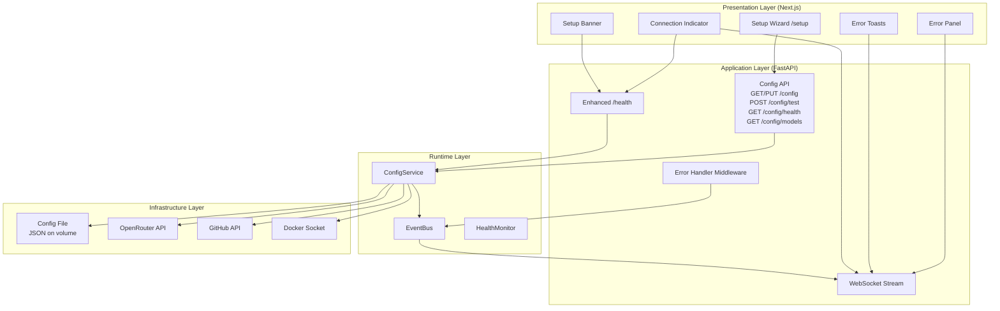
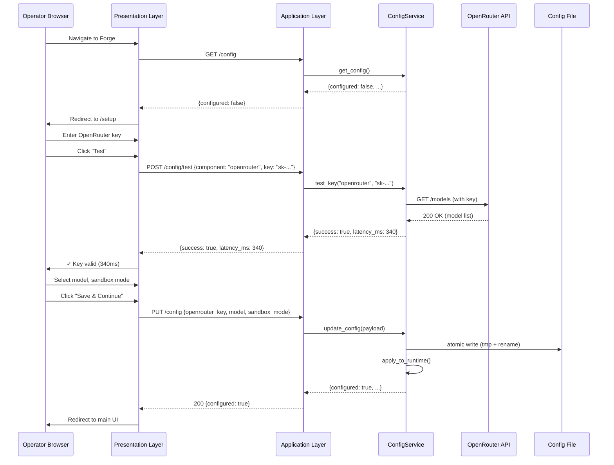
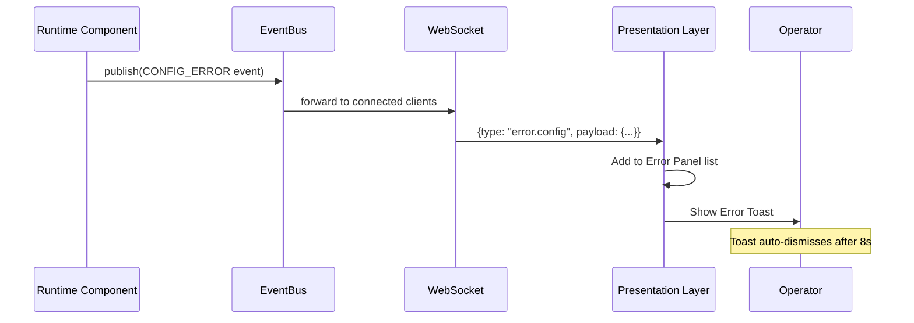
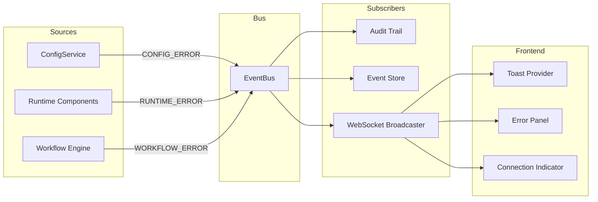

# Design Document: Forge Setup & Error Surfacing

## Overview

This feature adds two complementary subsystems to Forge: (1) a **Configuration & Setup** system with a backend ConfigService, REST API, persistent JSON storage, and first-run Setup Wizard; and (2) a **structured Error Surfacing** system that exposes categorized errors through the API, Event Bus, WebSocket stream, and frontend components. Together, they eliminate the need for operators to edit `.env` files or inspect server logs — all configuration and diagnostics happen through the UI.

The design integrates into Forge's existing 6-layer architecture (Presentation → Application → Workflow → Runtime → Adapters → Infrastructure) by placing the ConfigService at the Runtime layer, exposing it through new Application-layer endpoints, and consuming it from the Presentation layer's Setup Wizard and error components.

## Architecture



## Sequence Diagrams

### First-Run Setup Flow



### Error Surfacing Flow



## Components and Interfaces

### Component 1: ConfigService

**Purpose**: Loads, validates, persists, and serves Forge configuration. Single source of truth for all config state.

**Location**: `backend/app/runtime/config/__init__.py` (new module)

```python
from dataclasses import dataclass, field
from enum import Enum
from typing import Any
from pathlib import Path


class SandboxMode(str, Enum):
    ALWAYS = "always"
    AUTO = "auto"
    NEVER = "never"


@dataclass
class ConfigState:
    """The full configuration state persisted to disk."""
    openrouter_api_key: str = ""
    github_token: str = ""
    selected_model: str = ""
    sandbox_mode: SandboxMode = SandboxMode.AUTO
    model_cache_ttl_seconds: int = 3600

    @property
    def configured(self) -> bool:
        """True when all required fields are set."""
        return bool(self.openrouter_api_key and self.selected_model)


@dataclass
class KeyTestResult:
    """Result of an API key verification probe."""
    success: bool
    latency_ms: float
    error: str = ""
    details: dict[str, Any] = field(default_factory=dict)


class ConfigService:
    """Runtime configuration manager.

    Responsibilities:
    - Load config from JSON file on startup
    - Validate and persist config atomically (write-tmp-rename)
    - Test API keys against external services
    - Cache model lists with TTL
    - Emit CONFIG_ERROR events on failures
    - Redact secrets in all read responses
    """

    def __init__(
        self,
        config_path: Path,
        event_emitter: EventEmitter,
    ) -> None: ...

    async def load(self) -> ConfigState: ...
    async def get_config(self) -> dict[str, Any]: ...
    async def update_config(self, payload: dict[str, Any]) -> dict[str, Any]: ...
    async def test_key(self, component: str, key: str | None = None) -> KeyTestResult: ...
    async def get_models(self) -> list[dict[str, str]]: ...
    async def get_component_health(self) -> dict[str, ComponentHealth]: ...
    def apply_to_runtime(self, deps: RuntimeDeps) -> None: ...
```

**Responsibilities**:
- Atomic file persistence (write to `.tmp`, rename to target)
- Secret redaction (mask all but last 4 chars)
- API key testing with 10-second timeout
- Model list caching with configurable TTL
- Emit `CONFIG_ERROR` events on the EventBus when keys fail or Docker is missing

### Component 2: Error Handling Middleware

**Purpose**: Catches all exceptions and maps them to a structured ErrorEnvelope format.

**Location**: `backend/app/api/errors.py` (new file)

```python
from dataclasses import dataclass, field
from datetime import datetime, timezone
from enum import Enum
from typing import Any


class ErrorCategory(str, Enum):
    CONFIGURATION = "configuration"
    RUNTIME = "runtime"
    WORKFLOW = "workflow"
    CONNECTION = "connection"


@dataclass
class ErrorEnvelope:
    """Structured error response body returned on all 4xx/5xx responses."""
    code: str
    message: str
    category: ErrorCategory
    recoverable: bool
    timestamp: str = field(
        default_factory=lambda: datetime.now(timezone.utc).isoformat()
    )
    suggestion: str | None = None

    def to_dict(self) -> dict[str, Any]:
        result = {
            "code": self.code,
            "message": self.message,
            "category": self.category.value,
            "recoverable": self.recoverable,
            "timestamp": self.timestamp,
        }
        if self.suggestion:
            result["suggestion"] = self.suggestion
        return result
```

**Responsibilities**:
- Install as FastAPI exception handler for HTTPException and unhandled exceptions
- Map existing HTTPException responses to ErrorEnvelope format
- Log full tracebacks server-side for unhandled exceptions
- Never expose internal details in generic error responses
- Emit error events on the EventBus for real-time delivery

### Component 3: Enhanced Health Endpoint

**Purpose**: Per-component health reporting for operators and container orchestrators.

**Location**: Added to `backend/app/api/__init__.py` (new route in the existing app factory)

```python
@dataclass
class ComponentHealth:
    """Health status for a single component."""
    status: str  # "healthy", "degraded", "unhealthy"
    message: str = ""
    latency_ms: float | None = None


@dataclass
class HealthResponse:
    """Full health endpoint response."""
    status: str  # "healthy", "degraded", "unhealthy"
    configured: bool
    components: dict[str, ComponentHealth]
```

**Responsibilities**:
- No authentication required (external monitoring/orchestrator probing)
- Reports on: openrouter, github, docker, database, event_bus
- Computes overall status from component statuses
- Critical components (openrouter, database) → unhealthy overall when down
- Non-critical components → degraded overall when down

### Component 4: Config API Routes

**Purpose**: REST endpoints for config management consumed by the Setup Wizard.

**Location**: `backend/app/api/config.py` (new file)

```python
# Endpoints (all require Bearer auth except /health):
# GET  /config         → current config (redacted secrets) + configured boolean
# PUT  /config         → update config, returns updated state
# POST /config/test    → test a component's key, returns KeyTestResult
# GET  /config/health  → per-component health statuses
# GET  /config/models  → available OpenRouter models (cached)
```

**Responsibilities**:
- Delegates all logic to ConfigService
- Validates request payloads with Pydantic models
- Returns ErrorEnvelope on validation failures
- Requires authentication via existing `require_auth` dependency

### Component 5: Frontend — Setup Wizard

**Purpose**: Guided first-run configuration page.

**Location**: `frontend/app/setup/page.tsx` (new page)

**Responsibilities**:
- Sequential steps: API keys → Model selection → Sandbox mode
- "Test" buttons adjacent to key inputs
- Pre-populates with current (redacted) values if already configured
- Redirects to main UI on successful save

### Component 6: Frontend — Error Surfaces

**Purpose**: Toast notifications, persistent error panel, connection indicator, and setup banner.

**Location**: Multiple new components in `frontend/components/`

- `frontend/components/ErrorToast.tsx` — Transient notifications
- `frontend/components/ErrorPanel.tsx` — Persistent scrollable error list
- `frontend/components/ConnectionIndicator.tsx` — Top-bar colored dot
- `frontend/components/SetupBanner.tsx` — Configuration reminder banner
- `frontend/lib/error-store.ts` — Client-side error state management

## Data Models

### ConfigState (persisted to JSON)

```python
@dataclass
class ConfigState:
    openrouter_api_key: str = ""
    github_token: str = ""
    selected_model: str = ""
    sandbox_mode: SandboxMode = SandboxMode.AUTO
    model_cache_ttl_seconds: int = 3600

    @property
    def configured(self) -> bool:
        return bool(self.openrouter_api_key and self.selected_model)
```

**Validation Rules**:
- `openrouter_api_key`: non-empty string when provided (tested via Key_Test)
- `github_token`: optional, validated format (starts with `ghp_` or `github_pat_`)
- `selected_model`: must exist in cached model list when set
- `sandbox_mode`: must be one of `always`, `auto`, `never`
- `model_cache_ttl_seconds`: positive integer, default 3600

### ErrorEnvelope (API responses)

```python
@dataclass
class ErrorEnvelope:
    code: str              # e.g. "INVALID_API_KEY", "DOCKER_UNAVAILABLE"
    message: str           # Human-readable description
    category: ErrorCategory  # configuration | runtime | workflow | connection
    recoverable: bool      # Can the operator retry/fix this?
    timestamp: str         # ISO 8601 UTC
    suggestion: str | None = None  # Remediation hint
```

**Validation Rules**:
- `code`: uppercase snake_case identifier
- `category`: must be a valid ErrorCategory enum value
- `timestamp`: ISO 8601 format, always UTC
- `suggestion`: required when category is `configuration` or when `recoverable` is True

### ComponentHealth (health endpoint)

```python
@dataclass
class ComponentHealth:
    status: str            # "healthy" | "degraded" | "unhealthy"
    message: str = ""      # Error details when not healthy
    latency_ms: float | None = None  # Last probe latency
```

### New Event Types

```python
class EventType(str, Enum):
    # ... existing types ...

    # Error events (new)
    CONFIG_ERROR = "error.config"
    RUNTIME_ERROR = "error.runtime"
    WORKFLOW_ERROR = "error.workflow"
```

**Event Payload Schema** (for error events):
```python
{
    "code": str,           # Error code
    "message": str,        # Human-readable message
    "category": str,       # Error category
    "component": str,      # Affected component name
    "recoverable": bool,   # Whether operator can fix
    "suggestion": str | None,  # Remediation hint
    "session_id": str,     # Affected session (if applicable)
}
```

### Frontend Types (TypeScript)

```typescript
// lib/types.ts
export interface ErrorEnvelope {
  code: string;
  message: string;
  category: "configuration" | "runtime" | "workflow" | "connection";
  recoverable: boolean;
  timestamp: string;
  suggestion?: string;
}

export interface ComponentHealth {
  status: "healthy" | "degraded" | "unhealthy";
  message?: string;
  latency_ms?: number;
}

export interface HealthResponse {
  status: "healthy" | "degraded" | "unhealthy";
  configured: boolean;
  components: Record<string, ComponentHealth>;
}

export interface ConfigResponse {
  configured: boolean;
  openrouter_api_key: string;  // masked, e.g. "sk-****abcd"
  github_token: string;        // masked
  selected_model: string;
  sandbox_mode: "always" | "auto" | "never";
}

export interface KeyTestResult {
  success: boolean;
  latency_ms: number;
  error?: string;
  details?: Record<string, unknown>;
}
```

## New Files to Create

| File | Layer | Purpose |
|------|-------|---------|
| `backend/app/runtime/config/__init__.py` | Runtime | ConfigService implementation |
| `backend/app/api/config.py` | Application | Config REST endpoints |
| `backend/app/api/errors.py` | Application | ErrorEnvelope model + exception handlers |
| `frontend/app/setup/page.tsx` | Presentation | Setup Wizard page |
| `frontend/components/ErrorToast.tsx` | Presentation | Toast notification component |
| `frontend/components/ErrorPanel.tsx` | Presentation | Persistent error list |
| `frontend/components/ConnectionIndicator.tsx` | Presentation | WebSocket/API health dot |
| `frontend/components/SetupBanner.tsx` | Presentation | Unconfigured state banner |
| `frontend/lib/error-store.ts` | Presentation | Error state management |
| `frontend/lib/health.ts` | Presentation | Health polling hook |
| `backend/tests/test_config_service.py` | Testing | ConfigService unit tests |
| `backend/tests/test_config_api.py` | Testing | Config API integration tests |
| `backend/tests/test_error_handling.py` | Testing | Error envelope tests |

## Existing Files to Modify

| File | Change |
|------|--------|
| `backend/app/runtime/events/models.py` | Add `CONFIG_ERROR`, `RUNTIME_ERROR`, `WORKFLOW_ERROR` to EventType enum |
| `backend/app/workflow/deps.py` | Add `config_service: ConfigService` field to RuntimeDeps |
| `backend/app/workflow/bootstrap.py` | Instantiate ConfigService, load config, wire into deps |
| `backend/app/api/__init__.py` | Register error handlers, add `/health` enhanced endpoint, mount config router |
| `backend/app/workflow/app.py` | Wire ConfigService into AppDependencies and lifespan |
| `frontend/lib/api.ts` | Add config/health/test API client functions |
| `frontend/app/layout.tsx` | Add ConnectionIndicator and SetupBanner to layout |
| `frontend/app/page.tsx` | Add redirect logic for unconfigured state |
| `frontend/components/StatusBar.tsx` | Integrate ConnectionIndicator |

## API Endpoint Specifications

### GET /config

**Auth**: Required (Bearer token)
**Response 200**:
```json
{
  "configured": true,
  "openrouter_api_key": "sk-****abcd",
  "github_token": "ghp_****wxyz",
  "selected_model": "anthropic/claude-sonnet-4-20250514",
  "sandbox_mode": "auto"
}
```

### PUT /config

**Auth**: Required
**Request Body**:
```json
{
  "openrouter_api_key": "sk-or-v1-...",
  "github_token": "ghp_...",
  "selected_model": "anthropic/claude-sonnet-4-20250514",
  "sandbox_mode": "always"
}
```
**Response 200**: Same shape as GET /config (updated, redacted)
**Response 422**: ErrorEnvelope with invalid field details

### POST /config/test

**Auth**: Required
**Request Body**:
```json
{
  "component": "openrouter",
  "key": "sk-or-v1-..."
}
```
**Response 200**:
```json
{
  "success": true,
  "latency_ms": 340,
  "error": "",
  "details": {"models_available": 150}
}
```
**Response 200 (failure)**:
```json
{
  "success": false,
  "latency_ms": 10200,
  "error": "Request timed out after 10 seconds",
  "details": {}
}
```

### GET /config/health

**Auth**: Required
**Response 200**:
```json
{
  "openrouter": {"status": "healthy", "message": "", "latency_ms": 210},
  "github": {"status": "healthy", "message": "", "latency_ms": 180},
  "docker": {"status": "unhealthy", "message": "Docker socket not found", "latency_ms": null},
  "database": {"status": "healthy", "message": "", "latency_ms": 2},
  "event_bus": {"status": "healthy", "message": "", "latency_ms": null}
}
```

### GET /config/models

**Auth**: Required
**Response 200**:
```json
{
  "models": [
    {"id": "anthropic/claude-sonnet-4-20250514", "name": "Claude Sonnet 4", "context_length": 200000},
    {"id": "openai/gpt-4o", "name": "GPT-4o", "context_length": 128000}
  ],
  "cached": true,
  "cache_expires_at": "2024-01-15T12:30:00Z"
}
```

### GET /health (Enhanced — No Auth)

**Auth**: NOT required
**Response 200**:
```json
{
  "status": "degraded",
  "configured": true,
  "components": {
    "openrouter": {"status": "healthy", "message": ""},
    "github": {"status": "healthy", "message": ""},
    "docker": {"status": "unhealthy", "message": "Docker socket not found"},
    "database": {"status": "healthy", "message": ""},
    "event_bus": {"status": "healthy", "message": ""}
  }
}
```

## Correctness Properties

### Property 1: Config persistence round-trip
For all valid configurations `c`, `load(save(c)) == c` — data is never lost or corrupted through persistence.

**Validates: Requirements 1.1, 1.3, 1.5**

### Property 2: Secret redaction completeness
For all GET /config responses `r`, no field in `r` contains a full API key or token — only masked representations are returned.

**Validates: Requirements 1.6, 2.1**

### Property 3: Error envelope completeness
For all error responses `e` returned by the API, `e.code != ""` ∧ `e.category ∈ ErrorCategory` ∧ `e.timestamp` is valid ISO 8601.

**Validates: Requirements 8.1, 8.2, 8.3, 8.4**

### Property 4: Health aggregation consistency
For all component sets `cs`: if any critical component is unhealthy → overall is `unhealthy`; if only non-critical are unhealthy → overall is `degraded`; if all healthy → overall is `healthy`.

**Validates: Requirements 7.3, 7.4, 7.5**

### Property 5: Atomic write safety
For all config writes, if the process crashes mid-write, the config file is either the old valid content or the new valid content — never a partial write.

**Validates: Requirements 1.5**

### Property 6: Error event delivery
For all error events emitted on the EventBus, connected WebSocket clients receive the event with all payload fields (code, message, category, component, recoverable) intact.

**Validates: Requirements 9.4, 9.5**

### Property 7: Key test isolation
POST /config/test never modifies the persisted config file — failing or succeeding keys are only persisted via explicit PUT /config.

**Validates: Requirements 3.4**

### Property 8: Toast overflow safety
The number of visible toasts never exceeds 5; excess errors are summarized without data loss (they remain in the Error Panel).

**Validates: Requirements 11.4, 11.5**

## Error Handling

### Error Scenario 1: Invalid API Key

**Condition**: PUT /config or POST /config/test receives an authentication failure from external service
**Response**: ErrorEnvelope with code `INVALID_API_KEY`, category `configuration`
**Suggestion**: "Check that the API key is correct and not expired. You can generate a new key at [service URL]."
**Event**: `CONFIG_ERROR` emitted on EventBus

### Error Scenario 2: Docker Unavailable

**Condition**: Sandbox mode is `always` but Docker socket probe fails
**Response**: ErrorEnvelope with code `DOCKER_UNAVAILABLE`, category `configuration`
**Suggestion**: "Install Docker and mount /var/run/docker.sock, or change sandbox mode to 'auto' or 'never'."
**Event**: `CONFIG_ERROR` emitted on EventBus

### Error Scenario 3: Unhandled Exception

**Condition**: Any uncaught exception in request handling
**Response**: ErrorEnvelope with code `INTERNAL_ERROR`, category `runtime`, recoverable `false`, generic message
**Recovery**: Full traceback logged server-side; no internal details in response

### Error Scenario 4: WebSocket Disconnection

**Condition**: WebSocket connection drops
**Response**: Frontend adds `CONNECTION_ERROR` to Error Panel, transitions Connection Indicator to red
**Recovery**: Exponential backoff reconnection (1s → 2s → 4s → ... → 30s max)

### Error Scenario 5: Config File Corruption

**Condition**: Config file exists but contains invalid JSON
**Response**: ConfigService starts with defaults, emits `CONFIG_ERROR` event, reports unconfigured state
**Recovery**: Operator reconfigures via Setup Wizard; new valid config overwrites corrupted file

## Event Flow for Error Surfacing



**Event delivery guarantee**: At-least-once via EventBus retry (up to 5 attempts). Frontend deduplicates by `event_id`.

**Missed event recovery**: On WebSocket reconnect, frontend sends last received `seq` number. Backend replays events from `EventBus.replay(session_id, since_seq)`.

## Testing Strategy

### Unit Testing

- **ConfigService**: Load/save/validate/redact/atomic-write operations
- **ErrorEnvelope**: Serialization, field validation, suggestion generation
- **Key testers**: Mock external APIs, test timeout handling, auth error mapping
- **Health aggregation**: Component status → overall status logic

### Property-Based Testing (Hypothesis)

- Config round-trip: `∀ valid config c: load(save(c)) == c`
- Error envelope completeness: `∀ exception e: to_envelope(e).code != "" ∧ to_envelope(e).category ∈ ErrorCategory`
- Health aggregation: `∀ components cs: aggregate(cs).status == expected_from_rules(cs)`

### Integration Testing

- Full setup flow: Create app → GET /config → PUT /config → verify persistence
- Error middleware: Trigger various exceptions → verify ErrorEnvelope format
- WebSocket error delivery: Emit error event → verify client receives it
- Health endpoint: Configure components → verify per-component reporting

## Performance Considerations

- **Model list caching**: Cached for 1 hour (configurable) to avoid rate limiting on OpenRouter API
- **Health polling**: Frontend polls /health every 30s (configurable); not per-keystroke
- **Atomic writes**: Single rename operation; no file locking needed for single-process deployment
- **Error panel**: Capped at 200 entries with oldest-first eviction; no unbounded growth
- **Toast stacking**: Maximum 5 visible toasts; overflow summarized

## Security Considerations

- **Secret redaction**: API keys are NEVER returned in full via GET /config. Only masked representation (last 4 chars) is shown.
- **Auth required**: All config endpoints require Bearer token (same as existing auth). The /health endpoint is the only exception (for orchestrator probing).
- **Key testing isolation**: POST /config/test does NOT persist a failing key. Keys are only persisted after explicit PUT /config.
- **File permissions**: Config file written with restrictive permissions (0600) on the mounted volume.
- **No internal details**: INTERNAL_ERROR responses never leak stack traces, file paths, or class names to clients.

## Dependencies

- **Existing**: FastAPI, Pydantic, asyncio, httpx (for key testing HTTP calls)
- **New backend**: `httpx` (likely already present for OpenRouter adapter; needed for key test probes)
- **New frontend**: None beyond existing Next.js + Tailwind CSS + existing WebSocket infrastructure
- **External services**: OpenRouter API (model list, key validation), GitHub API (user endpoint for token validation), Docker socket (local probe)
