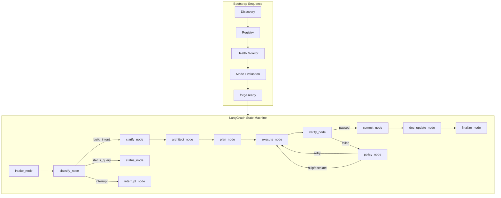
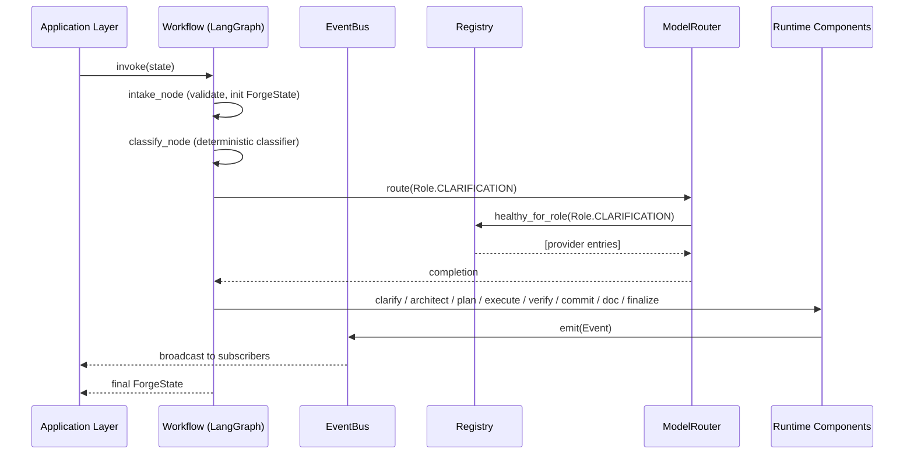

# Design Document: Forge LangGraph Workflow Integration

## Overview

This feature wires all existing Forge runtime components (EventBus, Registry, Discovery, HealthMonitor, ModelRouter, SessionManager, Classifier, Clarification, Specification, Planner, WorkspaceManager, TaskDispatcher, VerificationPipeline, PolicyEngine, CommitWorkflow, Finalization, Documentation, Inspector, Recovery, InterruptHandler, LearningRecorder) into a single LangGraph state machine that drives a `ForgeState` object through the build lifecycle.

The components already exist with protocol-based dependency injection and are individually tested. This design concerns only the wiring: defining node functions that delegate to existing components, constructing the graph with conditional routing, implementing the bootstrap sequence, and providing an application entry point.

## Architecture





## Components and Interfaces

### Component 1: ForgeState (Extended)

**Purpose**: The typed state object that flows through all LangGraph nodes.

```python
from typing import TypedDict, Any, Literal
from app.runtime.models import Task

class ForgeState(TypedDict, total=False):
    """LangGraph workflow state — extended for graph routing."""
    # Identity
    session_id: str
    status: str
    build_mode: Literal["new", "extend", "analyze", "document"]

    # Workflow routing
    intent: str  # classified intent: "build_intent", "status_query", "interrupt"
    message: str  # incoming user message
    node_path: list[str]  # breadcrumb of visited nodes (for checkpoint/resume)

    # Planning & execution
    tasks: list[Task]
    task_ordering: list[str]  # topological order from planner
    current_task_index: int
    current_task_id: str | None

    # References (not full objects — per design R4)
    digital_twin: str  # handle into twin store
    session_context: str  # handle into session context store
    spec_artifact_uri: str  # URI in artifact store

    # Results
    verification_results: dict[str, Any]
    commit_shas: list[str]
    decisions: list[str]  # decision_ids referencing the audit trail
    errors: list[dict[str, Any]]
    doc_updates: list[str]

    # Control flags
    needs_clarification: bool
    all_tasks_done: bool
    approval_pending: bool
```

**Responsibilities**:
- Carries all state between nodes (immutable per-step, updated by return)
- Kept small: large objects referenced by handle, not embedded
- Serializable for checkpointing

### Component 2: Node Functions Module

**Purpose**: Each node function wraps a call to an existing runtime component and returns an updated ForgeState dict.

```python
from langgraph.graph import StateGraph
from app.runtime.models import ForgeState

# Each node function has this signature:
async def node_name(state: ForgeState) -> dict:
    """Process state, delegate to runtime component, return state updates."""
    ...
```

**Responsibilities**:
- Receive ForgeState, call the appropriate runtime component
- Return only the changed keys (LangGraph merges them)
- Emit events via EventBus
- Record checkpoints after each node via CrashRecovery

### Component 3: Graph Builder

**Purpose**: Constructs the LangGraph StateGraph with nodes, edges, and conditional routing.

```python
from langgraph.graph import StateGraph, END

def build_forge_graph(deps: RuntimeDeps) -> StateGraph:
    """Construct the Forge workflow graph with all nodes and edges."""
    ...
```

**Responsibilities**:
- Register all node functions
- Wire edges (linear flow + conditional branches)
- Set entry point and end conditions
- Return a compiled graph ready for invocation

### Component 4: RuntimeDeps (Dependency Container)

**Purpose**: A simple container holding all instantiated runtime components, passed to node functions via closure.

```python
from dataclasses import dataclass
from app.runtime.events.bus import EventBus
from app.runtime.registry import CapabilityRegistry
from app.runtime.router import ModelRouter
from app.runtime.session import SessionManager
from app.runtime.recovery import CrashRecovery

@dataclass
class RuntimeDeps:
    """All runtime component instances, assembled at startup."""
    event_bus: EventBus
    registry: CapabilityRegistry
    model_router: ModelRouter
    session_manager: SessionManager
    classifier: Any  # IntentClassifier
    clarification: Any
    specification: Any
    planner: Any
    workspace_manager: Any
    task_dispatcher: Any
    verification_pipeline_factory: Any
    policy_engine: Any
    commit_workflow: Any
    finalization: Any
    documentation: Any
    inspector: Any
    recovery: CrashRecovery
    interrupt_handler: Any
    learning_recorder: Any
    health_monitor: Any
    discovery: Any
```

**Responsibilities**:
- Instantiated once at application startup
- Passed into node factory functions via closure capture
- No business logic — pure wiring container

### Component 5: Bootstrap Sequence

**Purpose**: Runs at application startup to bring the runtime to `forge.ready` state.

```python
async def bootstrap(deps: RuntimeDeps) -> None:
    """Run discovery → registry → health monitor → mode eval → forge.ready."""
    ...
```

**Responsibilities**:
- Load and validate configuration
- Run discovery (probe all resources concurrently)
- Register healthy capabilities
- Start health monitor background task
- Evaluate operational mode
- Emit `forge.ready` event

### Component 6: Application Entry Point

**Purpose**: Creates the FastAPI app, runs bootstrap, and starts uvicorn.

```python
from fastapi import FastAPI

def create_app() -> FastAPI:
    """Create and configure the FastAPI application with the wired workflow."""
    ...
```

**Responsibilities**:
- Instantiate all runtime components (build RuntimeDeps)
- Register FastAPI startup/shutdown lifespan events
- Wire API routes that invoke the graph
- Return configured app for uvicorn

## Data Models

### ForgeState Extensions

The existing `ForgeState` TypedDict in `models.py` needs these additions for graph routing:

```python
# New fields added to ForgeState
intent: str           # "build_intent" | "status_query" | "interrupt" | "natural_language"
message: str          # raw user message
node_path: list[str]  # visited nodes for checkpoint
task_ordering: list[str]  # topological order
current_task_index: int   # index into task_ordering
spec_artifact_uri: str    # artifact store URI
commit_shas: list[str]    # accumulated commit SHAs
doc_updates: list[str]    # files updated by doc writer
needs_clarification: bool # routing flag
all_tasks_done: bool      # loop exit condition
approval_pending: bool    # pause for approval gate
```

**Validation Rules**:
- `session_id` must be non-empty when entering any node past intake
- `tasks` list must be non-empty before entering execute node
- `task_ordering` must be set before execute node iterates
- `current_task_index` must be within bounds of `task_ordering`

### RuntimeDeps Assembly

```python
# No persistence model — RuntimeDeps is assembled in memory at startup
# and lives for the process lifetime.
```

## Key Functions with Formal Specifications

### Function: intake_node

```python
async def intake_node(state: ForgeState) -> dict:
    """Validate incoming message and initialize state for the workflow."""
```

**Preconditions:**
- `state["message"]` is a non-empty string
- `state["session_id"]` is a valid session identifier

**Postconditions:**
- Returns dict with `status` set to "processing"
- `node_path` extended with "intake"
- Checkpoint written via CrashRecovery

### Function: classify_node

```python
async def classify_node(state: ForgeState) -> dict:
    """Classify the message intent using the deterministic fast-path classifier."""
```

**Preconditions:**
- `state["message"]` is present and non-empty
- `state["session_id"]` identifies an active session

**Postconditions:**
- `intent` is one of: "build_intent", "status_query", "interrupt", "natural_language"
- Classification is deterministic for the same (message, build_state) pair
- No AI model invoked for interrupt/status/structured commands

### Function: clarify_node

```python
async def clarify_node(state: ForgeState) -> dict:
    """Run the clarification loop to gather missing specification inputs."""
```

**Preconditions:**
- `state["intent"]` == "build_intent"
- Session context is accessible via `state["session_context"]` handle

**Postconditions:**
- If all inputs present: `needs_clarification` = False, workflow advances
- If inputs missing: emits question events, `needs_clarification` = True
- Answers recorded in session context before returning

### Function: architect_node

```python
async def architect_node(state: ForgeState) -> dict:
    """Invoke the Architect role to produce spec + task list."""
```

**Preconditions:**
- `state["needs_clarification"]` is False
- Session context contains goals and constraints

**Postconditions:**
- `spec_artifact_uri` set to saved artifact URI
- `tasks` list populated with Task objects
- `spec.ready` and `tasks.ready` events emitted

### Function: plan_node

```python
async def plan_node(state: ForgeState) -> dict:
    """Construct dependency graph and produce topological ordering."""
```

**Preconditions:**
- `state["tasks"]` is a non-empty list of Task objects
- Each task has `id` and `depends_on` fields

**Postconditions:**
- `task_ordering` contains valid topological order
- `current_task_index` initialized to 0
- If cycle detected: `errors` populated, `status` = "plan_failed"

### Function: execute_node

```python
async def execute_node(state: ForgeState) -> dict:
    """Execute the current task in an isolated workspace."""
```

**Preconditions:**
- `state["task_ordering"]` is non-empty
- `state["current_task_index"]` < len(task_ordering)
- TaskDispatcher and WorkspaceManager are available in deps

**Postconditions:**
- Task workspace created and execution performed
- Task status updated to "running" then "verifying"
- `workspace.created` event emitted

### Function: verify_node

```python
async def verify_node(state: ForgeState) -> dict:
    """Run the verification pipeline on the current task's output."""
```

**Preconditions:**
- Current task has produced output in its workspace
- VerificationPipeline can be constructed for the task

**Postconditions:**
- `verification_results` updated with stage outcomes
- If all blocking stages pass: `verify.passed` emitted
- If any blocking stage fails: result includes failing stage info

### Function: commit_node

```python
async def commit_node(state: ForgeState) -> dict:
    """Commit verified changes and advance to next task or finalization."""
```

**Preconditions:**
- `verify.passed` has been emitted for the current task
- VCS connector is available in registry

**Postconditions:**
- Commit SHA appended to `commit_shas`
- `commit.done` event emitted
- `current_task_index` incremented
- `all_tasks_done` set if no more tasks

### Function: doc_update_node

```python
async def doc_update_node(state: ForgeState) -> dict:
    """Update documentation from twin diff after commits."""
```

**Preconditions:**
- At least one commit has been performed (`commit_shas` non-empty)
- DocWriter capability available or graceful degradation

**Postconditions:**
- `doc_updates` populated with changed files
- `doc_updated` event emitted
- Documentation drift recorded if update fails

### Function: finalize_node

```python
async def finalize_node(state: ForgeState) -> dict:
    """Push to VCS, emit build.done, record learning outcomes."""
```

**Preconditions:**
- `all_tasks_done` is True
- Canonical repository has committed changes

**Postconditions:**
- VCS push performed
- `build.done` event emitted with summary
- Learning outcomes recorded
- `status` set to "completed"

### Function: build_forge_graph

```python
def build_forge_graph(deps: RuntimeDeps) -> CompiledStateGraph:
    """Construct and compile the LangGraph workflow."""
```

**Preconditions:**
- All components in `deps` are instantiated and ready
- LangGraph library is importable

**Postconditions:**
- Returns a compiled graph that can process ForgeState via `invoke()` or `ainvoke()`
- Graph has conditional edges for intent routing, verify outcome, and task loop
- Interrupt node is reachable from classify

### Function: bootstrap

```python
async def bootstrap(deps: RuntimeDeps) -> None:
    """Initialize the runtime: discover, register, monitor, evaluate mode."""
```

**Preconditions:**
- Configuration files exist and are valid
- Network connectivity for health probes (or graceful timeout)

**Postconditions:**
- Registry populated with healthy capabilities
- Health monitor started as background task
- Operational mode determined
- `forge.ready` event emitted

## Algorithmic Pseudocode

### Main Workflow Routing

```python
# Conditional edge after classify_node:
def route_after_classify(state: ForgeState) -> str:
    """Determine next node based on classified intent."""
    match state["intent"]:
        case "build_intent":
            return "clarify"
        case "status_query":
            return "status"
        case "interrupt":
            return "interrupt"
        case _:
            return END


# Conditional edge after verify_node:
def route_after_verify(state: ForgeState) -> str:
    """Route based on verification outcome."""
    results = state.get("verification_results", {})
    current_task = state.get("current_task_id")
    if results.get(current_task, {}).get("passed", False):
        return "commit"
    else:
        return "policy"


# Conditional edge after policy_node:
def route_after_policy(state: ForgeState) -> str:
    """Route based on policy decision (retry/skip/escalate)."""
    # Policy engine sets this in state
    last_decision = state.get("decisions", [""])[-1] if state.get("decisions") else ""
    if "retry" in last_decision:
        return "execute"
    else:
        # skip or escalate — advance to next task or finish
        return "execute"  # execute_node checks current_task_index


# Conditional edge after commit_node:
def route_after_commit(state: ForgeState) -> str:
    """Continue execution loop or proceed to doc_update."""
    if state.get("all_tasks_done", False):
        return "doc_update"
    else:
        return "execute"
```

### Graph Construction Algorithm

```python
def build_forge_graph(deps: RuntimeDeps) -> CompiledStateGraph:
    graph = StateGraph(ForgeState)

    # Register nodes
    graph.add_node("intake", make_intake_node(deps))
    graph.add_node("classify", make_classify_node(deps))
    graph.add_node("clarify", make_clarify_node(deps))
    graph.add_node("architect", make_architect_node(deps))
    graph.add_node("plan", make_plan_node(deps))
    graph.add_node("execute", make_execute_node(deps))
    graph.add_node("verify", make_verify_node(deps))
    graph.add_node("policy", make_policy_node(deps))
    graph.add_node("commit", make_commit_node(deps))
    graph.add_node("doc_update", make_doc_update_node(deps))
    graph.add_node("finalize", make_finalize_node(deps))
    graph.add_node("status", make_status_node(deps))
    graph.add_node("interrupt", make_interrupt_node(deps))

    # Set entry point
    graph.set_entry_point("intake")

    # Linear edges
    graph.add_edge("intake", "classify")
    graph.add_edge("clarify", "architect")
    graph.add_edge("architect", "plan")
    graph.add_edge("plan", "execute")
    graph.add_edge("doc_update", "finalize")
    graph.add_edge("finalize", END)
    graph.add_edge("status", END)
    graph.add_edge("interrupt", END)

    # Conditional edges
    graph.add_conditional_edges("classify", route_after_classify)
    graph.add_conditional_edges("verify", route_after_verify)
    graph.add_conditional_edges("policy", route_after_policy)
    graph.add_conditional_edges("commit", route_after_commit)
    graph.add_conditional_edges("execute", lambda s: "verify")

    return graph.compile()
```

### Bootstrap Sequence Algorithm

```python
async def bootstrap(deps: RuntimeDeps) -> None:
    # Step 1: Load and validate config
    configs = load_and_validate_configs(config_paths)

    # Step 2: Extract resource configs
    resources = extract_resources_from_config(configs)

    # Step 3: Run concurrent discovery
    discovery_result = await run_discovery(
        resources=resources,
        registry=deps.registry,
        event_bus=deps.event_bus,
    )

    # Step 4: Start health monitor background task
    await deps.health_monitor.start()

    # Step 5: Evaluate operational mode
    summary = deps.registry.summary()

    # Step 6: Emit forge.ready
    await deps.event_bus.publish(Event.create(
        type=EventType.FORGE_READY,
        session_id="system",
        source="bootstrap",
        payload={
            "mode": summary.mode,
            "summary": asdict(summary),
        },
    ))
```

## Example Usage

```python
# Creating and invoking the workflow
from app.workflow.graph import build_forge_graph
from app.workflow.bootstrap import bootstrap, assemble_deps

async def main():
    # Assemble all runtime components
    deps = await assemble_deps()

    # Run bootstrap sequence
    await bootstrap(deps)

    # Build the graph
    graph = build_forge_graph(deps)

    # Invoke for a build session
    initial_state: ForgeState = {
        "session_id": "sess-123",
        "message": "Add user authentication with JWT",
        "status": "received",
        "build_mode": "new",
        "tasks": [],
        "errors": [],
        "decisions": [],
        "node_path": [],
        "commit_shas": [],
        "doc_updates": [],
        "needs_clarification": False,
        "all_tasks_done": False,
        "approval_pending": False,
    }

    final_state = await graph.ainvoke(initial_state)
    print(f"Build completed: {final_state['status']}")


# Application entry point
from app.workflow.app import create_app

app = create_app()
# Run with: uvicorn app.workflow.app:app --host 0.0.0.0 --port 8000
```

## Error Handling

### Error Scenario 1: Node execution failure

**Condition**: Any node function raises an unhandled exception
**Response**: Catch at the graph level, record error in `state["errors"]`, emit error event, write checkpoint
**Recovery**: Resume from last checkpoint via CrashRecovery

### Error Scenario 2: Bootstrap failure (config invalid)

**Condition**: Configuration validation fails during bootstrap
**Response**: Halt startup, emit error event, log validation failure, do not start uvicorn
**Recovery**: Fix configuration and restart

### Error Scenario 3: Model router exhaustion

**Condition**: All providers for a required role are unavailable
**Response**: ModelUnavailableError propagates to node, recorded in state errors, workflow pauses
**Recovery**: Wait for health monitor to recover a provider, or user intervention

### Error Scenario 4: Task execution failure with policy

**Condition**: Verification fails for a task
**Response**: PolicyEngine decides retry/escalate/skip, decision recorded in audit trail
**Recovery**: Retry re-enters execute node; skip advances current_task_index; escalate tries alternate tool

### Error Scenario 5: VCS push failure at finalization

**Condition**: Push to remote repository fails
**Response**: Retain committed changes locally, emit error event, do not emit `build.done`
**Recovery**: User can retry finalization or push manually

## Testing Strategy

### Unit Testing Approach

- Test each node function in isolation with mocked deps
- Verify correct state updates for each node
- Verify correct events emitted
- Test conditional routing functions with various state configurations

### Property-Based Testing Approach

**Property Test Library**: hypothesis

- Test graph routing determinism
- Test state invariant preservation across node sequences
- Test bootstrap produces consistent results for same config

### Integration Testing Approach

- Full graph invocation with mock adapters for all external services
- Verify complete happy-path flow (intake → finalize)
- Verify interrupt handling from any state
- Verify policy retry loops terminate

## Performance Considerations

- ForgeState kept small (handles, not full objects) for fast checkpointing
- Node functions are async — no blocking the event loop
- Bootstrap probes run concurrently (existing `probe_resources` uses `asyncio.gather`)
- Health monitor runs on a background task, doesn't block workflow invocations

## Security Considerations

- VCS tokens never stored in ForgeState or checkpoints (via SecretHolder + redaction)
- Workspaces are isolated — no cross-task file access
- Bootstrap validates config before probing (no partial-boot state)

## Correctness Properties

*A property is a characteristic or behavior that should hold true across all valid executions of a system — essentially, a formal statement about what the system should do. Properties serve as the bridge between human-readable specifications and machine-verifiable correctness guarantees.*

### Property 1: State merge preserves untouched keys

*For any* ForgeState dict and any partial update dict returned by a node function, all keys NOT present in the update dict SHALL remain unchanged in the merged result.

**Validates: Requirements 1.2**

### Property 2: Node functions return valid ForgeState keys only

*For any* node function invocation, all keys in the returned dict SHALL be valid ForgeState field names, and the node's own name SHALL appear appended to `node_path`.

**Validates: Requirements 2.1, 2.2**

### Property 3: Node error handling preserves workflow state

*For any* node function that encounters an unhandled exception from its delegated component, the node SHALL append an error entry to `errors` and emit an error event, without raising to the graph runner.

**Validates: Requirements 2.3**

### Property 4: Intake validation — valid inputs produce processing state

*For any* non-empty message string and valid session_id, the intake_node SHALL return `status` == "processing" and append "intake" to `node_path`.

**Validates: Requirements 3.1**

### Property 5: Intake validation — invalid inputs produce error state

*For any* empty or whitespace-only message string, the intake_node SHALL append an error with code "invalid_input" and set `status` to "failed".

**Validates: Requirements 3.2**

### Property 6: Classification determinism

*For any* (message, build_mode) pair, invoking classify_node twice SHALL produce the same `intent` value, and the intent SHALL be one of the four valid values: "build_intent", "status_query", "interrupt", "natural_language".

**Validates: Requirements 4.1, 4.2**

### Property 7: Routing function correctness

*For any* ForgeState with a valid `intent` field, the route_after_classify function SHALL return "clarify" for "build_intent", "status" for "status_query", "interrupt" for "interrupt", and END for unknown intents. Similarly, route_after_verify SHALL return "commit" when verification passes and "policy" when it fails, and route_after_commit SHALL return "execute" when `all_tasks_done` is False and "doc_update" when True.

**Validates: Requirements 13.1, 13.2, 13.3, 13.4, 13.5, 13.6, 13.7**

### Property 8: Topological ordering validity

*For any* task list forming a valid DAG, the plan_node SHALL produce a `task_ordering` where every task appears after all of its dependencies.

**Validates: Requirements 7.1**

### Property 9: Commit index progression

*For any* successful commit_node invocation, `current_task_index` SHALL increase by exactly 1, and the committed SHA SHALL be appended to `commit_shas`.

**Validates: Requirements 10.1, 10.2**

### Property 10: Verification result integrity

*For any* verification pipeline invocation where at least one blocking stage fails, `verification_results` SHALL include the failing stage name and a non-passing status.

**Validates: Requirements 9.1, 9.2**

## Dependencies

- `langgraph>=0.2.0` (already in pyproject.toml)
- `fastapi>=0.115.0` (already in pyproject.toml)
- `uvicorn>=0.32.0` (already in pyproject.toml)
- All existing runtime components (no new external dependencies)
