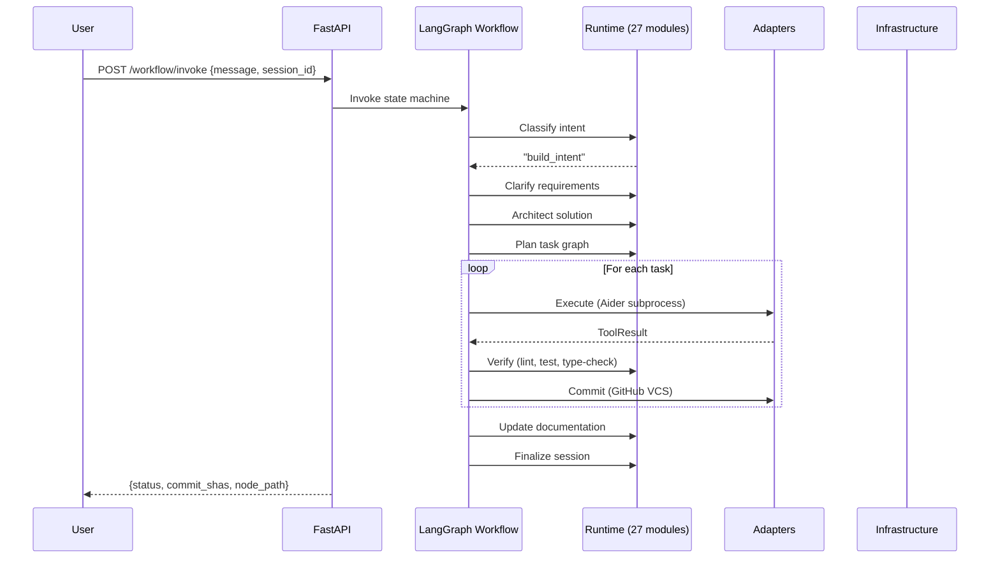

# Overview

## What is Forge?

Forge is an **autonomous software engineering runtime**. You supply a GitHub repository URL and a plain-English goal, and Forge plans, builds, reviews, verifies, and commits code — streaming every decision back in real time.

```
Developer: "Add user authentication with JWT"
    ↓
Forge: clarify → architect → plan → execute → verify → commit → push
    ↓
Result: Working code committed to your repo with full audit trail
```

Forge is not a chatbot that writes code snippets. It is a full build system that:

1. **Clarifies** ambiguous requirements before writing a line of code
2. **Architects** the solution against the repository's existing structure (Digital Twin)
3. **Plans** a topologically-ordered task graph
4. **Executes** each task in an isolated workspace using coding tools
5. **Verifies** each task against defined verification stages
6. **Commits** verified work atomically, with meaningful messages
7. **Documents** changes as a first-class artifact

## How It Works (High Level)



## Current Status

The project is **feature-complete for the core runtime**:

| Area | Status |
|------|--------|
| Runtime core (27 modules) | ✅ Complete |
| LangGraph workflow (13 nodes) | ✅ Wired and functional |
| Adapters (OpenRouter, GitHub, Aider, Sandboxed Aider, OpenHands) | ✅ Implemented |
| PostgreSQL persistence (4 tables) | ✅ Schema + stores ready |
| Docker deployment | ✅ Compose with health checks |
| Frontend (Next.js) | ✅ Responsive, real-time events |
| Property-based testing | ✅ 12 correctness properties |
| API authentication | ✅ Bearer token |
| WebSocket event streaming | ✅ Per-session |

## What Works TODAY vs. What Needs API Keys

### Works without any API keys (full test suite)

- All unit and property-based tests
- Event bus, registry, discovery, health monitoring
- Policy engine, budget enforcement, interrupt handling
- Workflow graph compilation and routing logic
- Session management, audit trail, crash recovery
- Boundary enforcement, secret redaction
- Frontend UI (connects to local API)

### Requires real API keys to function

| Feature | Key Required |
|---------|-------------|
| AI completions (clarify, architect, plan) | `OPENROUTER_API_KEY` |
| Repository clone/commit/push | `GITHUB_TOKEN` |
| Coding tool execution | One of three, checked in priority order by `_create_coding_tool()`: (1) `OPENHANDS_API_KEY` set → OpenHands Cloud; (2) Docker available → `SandboxedAiderTool` (no extra key needed); (3) fallback → direct `AiderTool` requiring `AIDER_MODEL` + Aider installed (unsandboxed, logs a security warning) |
| Database persistence | `DATABASE_URL` (PostgreSQL) |

Without keys, the system starts in **DEGRADED** mode — it reports what's missing and refuses builds, but all runtime logic remains exercisable.

## Tech Stack

| Layer | Technology |
|-------|-----------|
| Language | Python 3.11 |
| API Framework | FastAPI + Uvicorn |
| Workflow Engine | LangGraph (StateGraph) |
| Async Runtime | asyncio |
| Database | PostgreSQL 16 + asyncpg |
| Migrations | Alembic |
| Frontend | Next.js 14, React 18, TypeScript |
| Styling | Tailwind CSS 3.4 |
| Container | Docker + Docker Compose |
| Testing | pytest, Hypothesis, pytest-asyncio |
| Linting | Ruff |
| HTTP Client | httpx |

## Key Design Principles

1. **Event Bus as single source of truth** — audit, WebSocket broadcast, and learning are all event subscribers
2. **Protocol-based dependency injection** — runtime modules depend on protocols, not implementations
3. **Secrets never persisted** — redacted at every serialization boundary
4. **Deterministic intent classification** — "stop" never depends on AI being reachable
5. **Workspace isolation** — each task runs in a sandboxed copy, never touches the canonical repo
6. **Adjacent-layer-only communication** — strict boundary enforcement prevents architectural drift
