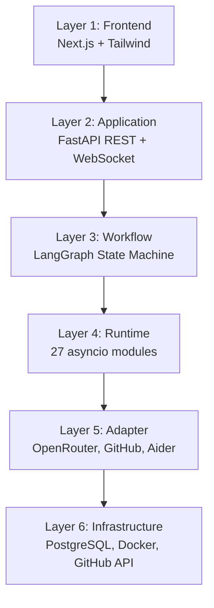
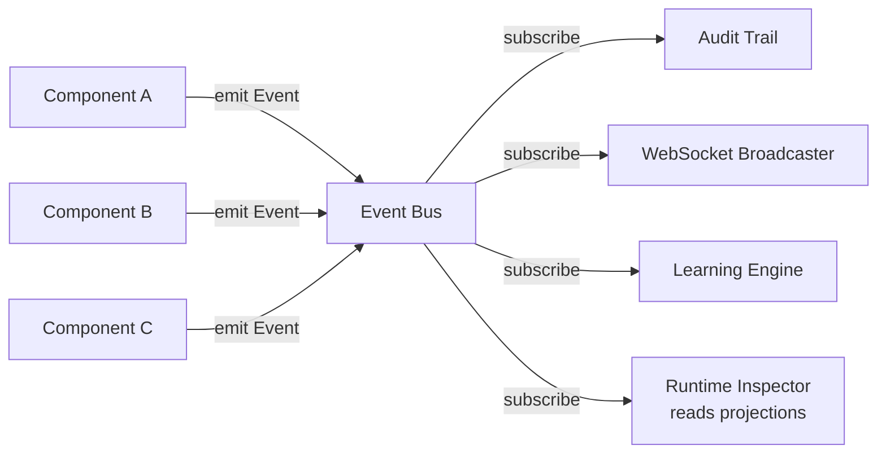
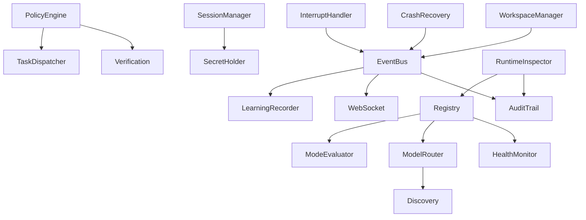
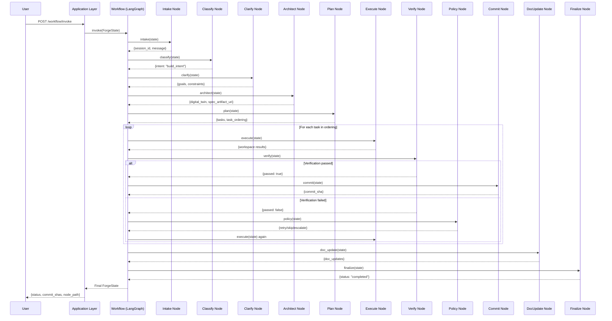

# Architecture

## 6-Layer Design

Forge uses a strict 6-layer architecture. Each layer communicates only with its adjacent layer through defined interfaces.



## Layer Responsibilities

### Layer 1: Frontend

| Aspect | Detail |
|--------|--------|
| **Location** | `frontend/` |
| **Technology** | Next.js 14, React 18, Tailwind CSS, TypeScript |
| **Responsibility** | Render chat, session list, event log, status bar |
| **Boundary rule** | Knows nothing about models, tools, or orchestration |
| **Communicates with** | Application layer via REST + WebSocket |

### Layer 2: Application

| Aspect | Detail |
|--------|--------|
| **Location** | `backend/app/api/` |
| **Technology** | FastAPI, Pydantic, uvicorn |
| **Responsibility** | HTTP/WS boundary, session CRUD, event broadcasting, auth |
| **Boundary rule** | Contains zero engineering logic — pure transport translation |
| **Communicates with** | Workflow layer (invocation), Runtime (session, inspector, interrupt) |

### Layer 3: Workflow

| Aspect | Detail |
|--------|--------|
| **Location** | `backend/app/workflow/` |
| **Technology** | LangGraph StateGraph |
| **Responsibility** | Orchestrate the build lifecycle as a state machine |
| **Boundary rule** | Nodes are thin wrappers that delegate to runtime components |
| **Communicates with** | Runtime layer (all 27 modules via RuntimeDeps) |

### Layer 4: Runtime

| Aspect | Detail |
|--------|--------|
| **Location** | `backend/app/runtime/` |
| **Technology** | Pure Python asyncio, Protocol interfaces |
| **Responsibility** | All state, all events, all decisions |
| **Boundary rule** | Contains zero HTTP/transport logic. Depends on adapters via protocols only |
| **Communicates with** | Adapter layer (via protocol interfaces) |

### Layer 5: Adapter

| Aspect | Detail |
|--------|--------|
| **Location** | `backend/app/adapters/` |
| **Technology** | httpx, asyncio subprocess |
| **Responsibility** | Translate one protocol call into one infrastructure call |
| **Boundary rule** | Contains zero business logic. No back-imports to runtime (except via shared types) |
| **Communicates with** | Infrastructure (HTTP APIs, CLIs, databases) |
| **Shared types** | Imports `Health`, `ToolResult`, `PermanentError` from `app/shared/` |

### Layer 6: Infrastructure

| Aspect | Detail |
|--------|--------|
| **Technology** | PostgreSQL, Docker, GitHub API, OpenRouter API, Aider CLI |
| **Responsibility** | External services not controlled by Forge code |
| **Boundary rule** | Only accessed through adapters |

## Communication Rules

```
✅ Layer N can call Layer N+1 (downward only)
✅ Layer N can return data to Layer N-1 (upward via return values)
❌ Layer N cannot skip layers (e.g., API cannot call Adapter directly)
❌ Adapter cannot import from Runtime (no back-imports)
❌ Runtime cannot import from API (no transport awareness)
```

### Shared Layer Exception

The `app/shared/` module contains types shared across layers (Health, ToolResult, PermanentError). Both Adapters and Runtime can import from Shared. This avoids circular dependencies while maintaining clean boundaries.

```
✅ Adapter can import from Shared (for Health, ToolResult types)
✅ Runtime can import from Shared (for shared types)
❌ Shared cannot import from Adapter or Runtime (no back-imports)
```

The boundary checker (`app/boundaries.py`) enforces these rules at test time:

```python
from app.boundaries import check_all_boundaries
violations = check_all_boundaries(app_root)  # Returns list of BoundaryViolation
```

## The Event Bus — Architectural Spine

The Event Bus is the single source of truth for everything that happens in Forge.



### Event Structure

Every event in the system follows this schema:

```python
@dataclass
class Event:
    schema_version: str       # "1.0"
    seq: int                  # Monotonically increasing per session
    session_id: str           # Which session produced this event
    type: EventType           # Typed enum (TASK_START, FORGE_READY, etc.)
    timestamp: datetime       # When the event was created
    source: str               # Which component emitted it
    payload: dict[str, Any]   # Event-specific data
    event_id: str             # Unique event identifier
    causation_id: str | None  # What caused this event
    correlation_id: str       # Trace across related events
```

### Why the Event Bus Matters

1. **Audit trail** is a projection of events — never constructed from state
2. **WebSocket streaming** to the frontend is just another subscriber
3. **Learning engine** records outcomes by observing events, not by coupling to execution
4. **Inspector** queries the audit trail (never the components directly)
5. **Crash recovery** replays from the last checkpointed event sequence

## Component Dependency Graph



## Data Flow: Complete Build Lifecycle



## Concurrency Model

- **Single-process asyncio core** (v1) — no distributed workers yet
- **Blocking work** (git clone, Aider subprocess) runs in thread/process executors
- **Sequential task execution** with a parallelism seam ready for future expansion
- **Per-session locks** for event ordering guarantees
- **Circuit breakers** with cancellable backoff for transient provider failures
