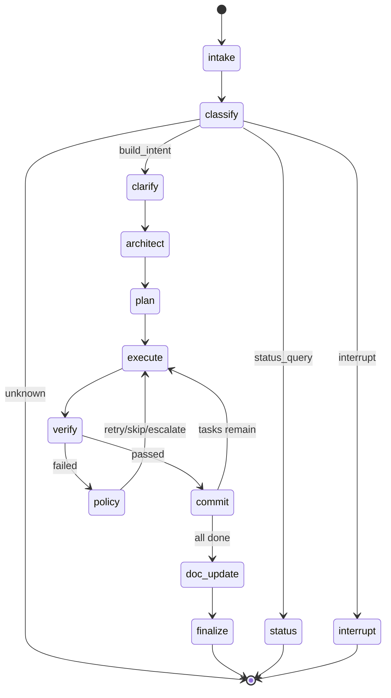
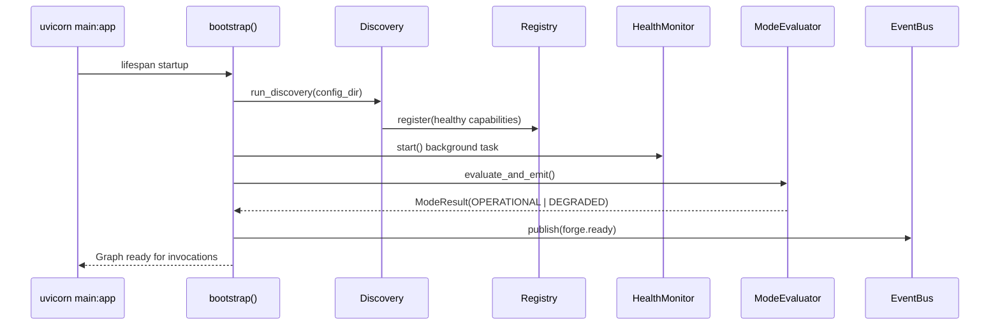

# Workflow — LangGraph State Machine

The workflow layer (`backend/app/workflow/`) orchestrates builds using a LangGraph `StateGraph`. It contains 13 nodes, 4 conditional routing functions, and a bootstrap sequence.

## State Machine Diagram



## ForgeState TypedDict

The `ForgeState` TypedDict is the single state object passed through all nodes. LangGraph manages its lifecycle.

```python
class ForgeState(TypedDict, total=False):
    # Identity
    session_id: str                    # Unique session identifier
    status: str                        # Current workflow status
    build_mode: Literal["new", "extend", "analyze", "document"]

    # Workflow routing
    intent: str                        # Classified intent from user message
    message: str                       # Raw incoming user message
    node_path: list[str]               # Breadcrumb of visited nodes

    # Planning & execution
    tasks: list[Task]                  # The task graph
    task_ordering: list[str]           # Topological order of task IDs
    current_task_index: int            # Progress pointer
    current_task_id: str | None        # Active task

    # References (handles, not full objects — keeps checkpoints small)
    digital_twin: str                  # Handle to twin store
    session_context: str               # Handle to session context store
    spec_artifact_uri: str             # URI in artifact store

    # Results
    verification_results: dict         # task_id -> {passed, details}
    commit_shas: list[str]             # All committed SHAs
    decisions: list[str]               # Decision IDs (audit trail references)
    errors: list[dict]                 # Accumulated errors
    doc_updates: list[str]             # Documentation files updated

    # Control flags
    needs_clarification: bool          # Should we ask before proceeding?
    all_tasks_done: bool               # Loop termination flag
    approval_pending: bool             # Waiting for human approval?
```

**Design note:** Large/growing objects (Digital Twin, audit log) are referenced by handle, not embedded. This keeps LangGraph checkpoints small and serialization cheap.

## Node Functions

All nodes follow the factory pattern:

```python
def make_X_node(deps: RuntimeDeps) -> Callable[[ForgeState], Awaitable[dict]]:
    """Returns an async function that accepts ForgeState and returns state updates."""
    async def X_node(state: ForgeState) -> dict:
        # Delegate to runtime component via deps
        ...
        return {"field": new_value, "node_path": state.get("node_path", []) + ["X"]}
    return X_node
```

### Node Descriptions

| Node | Delegates To | What It Does |
|------|-------------|--------------|
| `intake` | SessionManager | Validate session, initialize state fields |
| `classify` | IntentClassifier | Determine intent: build, status, interrupt, or unknown |
| `clarify` | ClarificationEngine + ModelRouter | Ask AI to refine goals, update SessionContext |
| `architect` | ModelRouter + SpecificationGenerator | Build Digital Twin, generate spec |
| `plan` | TaskPlanner | Break spec into tasks, topological sort |
| `execute` | TaskDispatcher + WorkspaceManager + Adapter | Run coding tool in isolated workspace |
| `verify` | VerificationPipeline | Run lint/test/type-check on workspace |
| `policy` | PolicyEngine | Decide retry/skip/escalate on failure |
| `commit` | CommitHandler + VCS Adapter | Stage, commit, advance task index |
| `doc_update` | DocumentationManager | Detect drift, update docs |
| `finalize` | Finalizer | Clean up, emit summary, set status |
| `status` | RuntimeInspector | Answer status queries without AI |
| `interrupt` | InterruptHandler | Process pause/resume/stop signals |

## Routing Logic

Four conditional routing functions drive the state machine. All are **pure functions** on ForgeState — no side effects.

### `route_after_classify`

```python
def route_after_classify(state: ForgeState) -> str:
    intent = state.get("intent", "")
    if intent == "build_intent":   return "clarify"
    elif intent == "status_query": return "status"
    elif intent == "interrupt":    return "interrupt"
    else:                          return END  # Unknown intent
```

### `route_after_verify`

```python
def route_after_verify(state: ForgeState) -> str:
    results = state.get("verification_results", {})
    current_task = state.get("current_task_id")
    if current_task and results.get(current_task, {}).get("passed", False):
        return "commit"   # Verification passed
    else:
        return "policy"   # Verification failed → policy decides
```

### `route_after_policy`

```python
def route_after_policy(state: ForgeState) -> str:
    return "execute"  # Always retries (policy node modifies state: reset/skip/swap)
```

### `route_after_commit`

```python
def route_after_commit(state: ForgeState) -> str:
    if state.get("all_tasks_done", False):
        return "doc_update"  # All tasks complete
    else:
        return "execute"     # More tasks remain
```

## Bootstrap Sequence

The bootstrap runs at application startup before the graph accepts invocations:



**Step by step:**

1. **Load config** — Read YAML files from `config/` directory
2. **Discovery** — Probe all configured resources concurrently (AI providers, VCS, tools)
3. **Register** — Healthy resources get entries in the Capability Registry
4. **Health Monitor** — Background task starts periodic re-checking
5. **Mode evaluation** — Determines OPERATIONAL (all required caps met) or DEGRADED
6. **forge.ready** — Event emitted; system is ready to accept workflow invocations

## Graph Construction

The graph is built in `graph.py`:

```python
def build_forge_graph(deps: RuntimeDeps) -> CompiledStateGraph:
    graph = StateGraph(ForgeState)
    
    # Register all 13 nodes
    graph.add_node("intake", make_intake_node(deps))
    graph.add_node("classify", make_classify_node(deps))
    # ... all 13 nodes
    
    # Set entry point
    graph.set_entry_point("intake")
    
    # Linear edges
    graph.add_edge("intake", "classify")
    graph.add_edge("clarify", "architect")
    graph.add_edge("architect", "plan")
    graph.add_edge("plan", "execute")
    graph.add_edge("doc_update", "finalize")
    graph.add_edge("finalize", END)
    graph.add_edge("status", END)
    graph.add_edge("interrupt", END)
    
    # Conditional edges
    graph.add_conditional_edges("classify", route_after_classify)
    graph.add_conditional_edges("verify", route_after_verify)
    graph.add_conditional_edges("policy", route_after_policy)
    graph.add_conditional_edges("commit", route_after_commit)
    
    return graph.compile()
```

## Extending the Workflow

To add a new node:

1. Create `backend/app/workflow/nodes/your_node.py`:
   ```python
   from app.workflow.deps import RuntimeDeps
   from app.runtime.models import ForgeState

   def make_your_node(deps: RuntimeDeps):
       async def your_node(state: ForgeState) -> dict:
           # Delegate to a runtime component
           result = await deps.some_component.do_thing(state["session_id"])
           return {
               "your_field": result,
               "node_path": state.get("node_path", []) + ["your_node"],
           }
       return your_node
   ```

2. Export from `backend/app/workflow/nodes/__init__.py`

3. Register in `graph.py`:
   ```python
   graph.add_node("your_node", make_your_node(deps))
   ```

4. Wire edges (linear or conditional) to connect it into the flow

5. Add tests in `tests/test_workflow_nodes.py`
