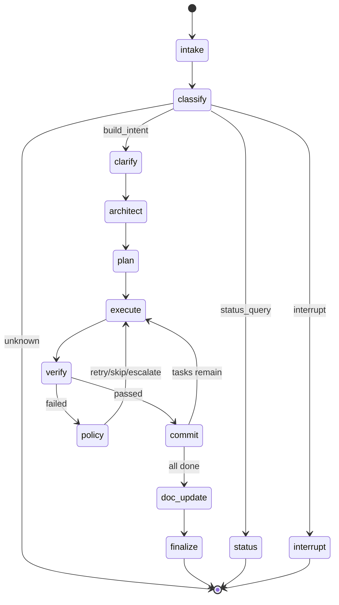
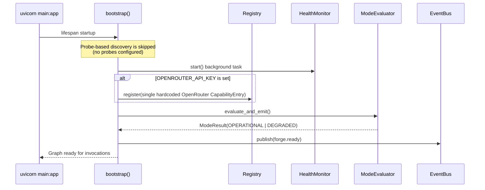

# Workflow — LangGraph State Machine

The workflow layer (`backend/app/workflow/`) orchestrates builds using a LangGraph `StateGraph`. It contains 13 nodes, 4 named conditional routing functions (plus one trivial no-op conditional edge), and a bootstrap sequence.

## State Machine Diagram



## ForgeState TypedDict

The `ForgeState` TypedDict is the single state object passed through all nodes. LangGraph manages its lifecycle.

```python
class ForgeState(TypedDict, total=False):
    # Identity
    session_id: str                    # Unique session identifier
    status: str                        # Current workflow status
    build_mode: Literal["new", "extend", "analyze", "document"]
    repo_url: str                      # Target repo URL for clone/push operations

    # Workflow routing
    intent: str                        # Classified intent from user message
    message: str                       # Raw incoming user message
    node_path: list[str]               # Breadcrumb of visited nodes

    # Planning & execution
    tasks: list[Task]                  # The task graph
    task_ordering: list[str]           # Topological order of task IDs
    current_task_index: int            # Progress pointer
    current_task_id: str | None        # Active task

    # Workspace (set by execute node, read by commit node)
    workspace_path: str                # Filesystem path to the active workspace
    allowed_paths: list[str] | None    # Task-scoped path whitelist for the scope check

    # References (handles, not full objects — keeps checkpoints small)
    digital_twin: str                  # Handle to twin store
    session_context: str               # Handle to session context store
    spec_artifact_uri: str             # URI in artifact store

    # Results
    verification_results: dict         # task_id -> {passed, details}
    commit_shas: list[str]             # All committed SHAs
    decisions: list[str]               # Decision IDs (audit trail references)
    errors: list[dict]                 # Accumulated errors
    doc_updates: list[str]             # Documentation files updated

    # Control flags
    needs_clarification: bool          # Should we ask before proceeding?
    all_tasks_done: bool               # Loop termination flag
    approval_pending: bool             # Waiting for human approval?
```

**Design note:** Large/growing objects (Digital Twin, audit log) are referenced by handle, not embedded. This keeps LangGraph checkpoints small and serialization cheap.

## Node Functions

All nodes follow the factory pattern:

```python
def make_X_node(deps: RuntimeDeps) -> Callable[[ForgeState], Awaitable[dict]]:
    """Returns an async function that accepts ForgeState and returns state updates."""
    async def X_node(state: ForgeState) -> dict:
        # Delegate to runtime component via deps
        ...
        return {"field": new_value, "node_path": state.get("node_path", []) + ["X"]}
    return X_node
```

### Node Descriptions

| Node | Delegates To | What It Does |
|------|-------------|--------------|
| `intake` | *(none)* | Validates that `message` is non-empty (fails the node otherwise) and calls `deps.recovery.checkpoint_after_node()`. Does not call SessionManager. |
| `classify` | `app.runtime.classifier.classify()` | Module-level deterministic classifier function (not a class). Determine intent: build, status, interrupt, or unknown |
| `clarify` | `app.runtime.clarification.get_missing_inputs()` / `run_clarification()` | Checks for missing static specification inputs and emits clarification question events if any are missing. Does **not** call `deps.model_router` — no AI is invoked in this node. |
| `architect` | `deps.model_router.route(Role.ARCHITECT, ...)` | Invokes the Architect role via the model router and parses the JSON response into a spec URI + `Task` list inline. Does not use `app.runtime.specification.SpecificationGenerator` (present in the codebase but unused here). |
| `plan` | `app.runtime.planner.plan()` | Module-level function (not a class) that topologically sorts tasks by dependency. |
| `execute` | `deps.workspace_manager.create()` + `deps.vcs.clone()` + `deps.coding_tool.execute()` | Directly creates the workspace, clones the repo (tries `main`, falls back to `master` if that ref fails), and runs the coding tool inline. Does not use `app.runtime.dispatcher.TaskDispatcher` (present in the codebase but unused here). |
| `verify` | `app.runtime.verification.VerificationPipeline` | Constructs a `VerificationPipeline` directly, but currently always with `advisory_stages=[]` and `blocking_stages=[]` — a placeholder noted in the node's own code comment ("In production, deps would have a verification_pipeline_factory"). As a result, verification currently always passes trivially; no real lint/test/type-check runs yet. |
| `policy` | `deps.policy_engine.decide()` | Decide retry/skip/escalate on failure |
| `commit` | `check_diff_scope()` + `deps.vcs.commit()` / `push()` | No "CommitHandler" class exists. The node runs the scope check, configures `git config user.email`/`user.name` via raw subprocess calls, then commits and pushes via the VCS adapter, all inline. |
| `doc_update` | *(none — stub)* | **Unimplemented placeholder.** The node's own comment says "Placeholder: In production, this would invoke the DocWriter capability." It always returns `doc_updates: []` and never calls `app.runtime.documentation.DocumentationMaintenance` or any DocWriter. Graceful degradation only — no drift detection or doc writing actually happens yet. |
| `finalize` | `deps.learning_recorder.record_build_outcomes()` | No "Finalizer" class exists. The node inlines emitting a `BUILD_DONE` event and calls the learning recorder directly, but with hardcoded placeholder fields (`tool: "unknown"`, `model: "unknown"`, `role: "coder"`, `retry_count: 0`, `escalation_flag: False`) that are never populated from real execution data. |
| `status` | `deps.inspector.get_status(session_id)` | Calls the inspector, but the result is currently discarded and never included in the returned state dict — a known gap. |
| `interrupt` | `deps.interrupt_handler` | Process pause/resume/stop signals |

## Routing Logic

Four named conditional routing functions drive most of the state machine. All are **pure functions** on ForgeState — no side effects. There's also a fifth conditional edge, `execute` → `verify`, wired via `graph.add_conditional_edges("execute", lambda s: "verify")`. It's functionally a no-op (always routes to `verify`) but is registered as a conditional edge rather than a plain linear edge — see [Graph Construction](#graph-construction).

### `route_after_classify`

```python
def route_after_classify(state: ForgeState) -> str:
    intent = state.get("intent", "")
    if intent == "build_intent":   return "clarify"
    elif intent == "status_query": return "status"
    elif intent == "interrupt":    return "interrupt"
    else:                          return END  # Unknown intent
```

### `route_after_verify`

```python
def route_after_verify(state: ForgeState) -> str:
    results = state.get("verification_results", {})
    current_task = state.get("current_task_id")
    if current_task and results.get(current_task, {}).get("passed", False):
        return "commit"   # Verification passed
    else:
        return "policy"   # Verification failed → policy decides
```

### `route_after_policy`

```python
def route_after_policy(state: ForgeState) -> str:
    return "execute"  # Always retries (policy node modifies state: reset/skip/swap)
```

### `route_after_commit`

```python
def route_after_commit(state: ForgeState) -> str:
    if state.get("all_tasks_done", False):
        return "doc_update"  # All tasks complete
    else:
        return "execute"     # More tasks remain
```

## Bootstrap Sequence

The bootstrap runs at application startup before the graph accepts invocations:



**Step by step (as actually implemented today):**

1. **Load config** — Read YAML files from `config/` directory
2. **Discovery is skipped** — The bootstrap explicitly logs "Skipping probe-based discovery (no probes configured)." There is no concurrent probing of AI providers, VCS, or tools.
3. **Health Monitor** — Background task starts periodic re-checking (of whatever ends up registered)
4. **Register** — Instead of discovery-driven registration, bootstrap manually registers exactly one hardcoded `CapabilityEntry` for OpenRouter (`Capability.AI_CODER`, all roles) if and only if `OPENROUTER_API_KEY` is set in the environment. GitHub VCS and the coding tool adapters (Aider, OpenHands, sandboxed variants) are constructed and wired into `RuntimeDeps` directly — they are **never** registered in the Capability Registry.
5. **Mode evaluation** — `ModeEvaluator` only ever sees the single OpenRouter capability (or none, if the key is absent). It determines OPERATIONAL (required caps met) or DEGRADED based on that one entry, not a full discovery-driven picture of the system's resources.
6. **forge.ready** — Event emitted; system is ready to accept workflow invocations

## Graph Construction

The graph is built in `graph.py`:

```python
def build_forge_graph(deps: RuntimeDeps) -> CompiledStateGraph:
    graph = StateGraph(ForgeState)
    
    # Register all 13 nodes
    graph.add_node("intake", make_intake_node(deps))
    graph.add_node("classify", make_classify_node(deps))
    # ... all 13 nodes
    
    # Set entry point
    graph.set_entry_point("intake")
    
    # Linear edges
    graph.add_edge("intake", "classify")
    graph.add_edge("clarify", "architect")
    graph.add_edge("architect", "plan")
    graph.add_edge("plan", "execute")
    graph.add_edge("doc_update", "finalize")
    graph.add_edge("finalize", END)
    graph.add_edge("status", END)
    graph.add_edge("interrupt", END)
    
    # Conditional edges
    graph.add_conditional_edges("classify", route_after_classify)
    graph.add_conditional_edges("execute", lambda s: "verify")
    graph.add_conditional_edges("verify", route_after_verify)
    graph.add_conditional_edges("policy", route_after_policy)
    graph.add_conditional_edges("commit", route_after_commit)
    
    return graph.compile()
```

Note that `execute → verify` is wired as a conditional edge with a lambda that always returns `"verify"`, not a plain `add_edge`. It behaves identically to a linear edge today, but is technically a routing function like the other four.

## Extending the Workflow

To add a new node:

1. Create `backend/app/workflow/nodes/your_node.py`:
   ```python
   from app.workflow.deps import RuntimeDeps
   from app.runtime.models import ForgeState

   def make_your_node(deps: RuntimeDeps):
       async def your_node(state: ForgeState) -> dict:
           # Delegate to a runtime component
           result = await deps.some_component.do_thing(state["session_id"])
           return {
               "your_field": result,
               "node_path": state.get("node_path", []) + ["your_node"],
           }
       return your_node
   ```

2. Export from `backend/app/workflow/nodes/__init__.py`

3. Register in `graph.py`:
   ```python
   graph.add_node("your_node", make_your_node(deps))
   ```

4. Wire edges (linear or conditional) to connect it into the flow

5. Add tests in `tests/test_workflow_nodes.py`
