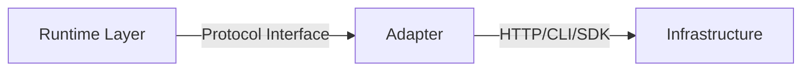

# Adapters

Adapters live in `backend/app/adapters/` and translate protocol calls from the runtime layer into concrete infrastructure calls. They contain zero business logic.



---

## OpenRouter AI Provider

**File:** `backend/app/adapters/openrouter.py`

### What It Does

Provides chat completions via the [OpenRouter](https://openrouter.ai) API, which gives access to all major AI models (Claude, GPT-4, Llama, etc.) through a single API key.

### Configuration

| Variable | Default | Description |
|----------|---------|-------------|
| `OPENROUTER_API_KEY` | — | Required. OpenRouter API key |
| Timeout | 60s | Per-request timeout |

### Class: `OpenRouterProvider`

```python
class OpenRouterProvider:
    name = "openrouter"
    
    async def complete(messages: list, model: str, **kwargs) -> str
    async def stream(messages: list, model: str, **kwargs) -> AsyncIterator[str]
    async def health_check() -> Health
    def as_call_adapter() -> Callable  # Returns ModelCallAdapter signature
    async def close() -> None
```

### Error Classification

The adapter classifies HTTP errors into retryable and permanent:

| HTTP Status | Classification | Behavior |
|-------------|---------------|----------|
| 200 | Success | Return content |
| 401, 403 | `PermanentError` | Circuit breaker opens, no retry |
| 429 | Transient (rate limit) | RuntimeError, will be retried |
| 5xx | Transient (server) | RuntimeError, will be retried |

### Streaming

The `stream()` method uses SSE (Server-Sent Events):

```python
async for token in provider.stream(messages, model="anthropic/claude-sonnet-4-20250514"):
    print(token, end="")
```

Parses `data: {...}` lines, skips `[DONE]`, extracts `choices[0].delta.content`.

### Integration with Model Router

The `as_call_adapter()` method returns a closure matching the `ModelCallAdapter` signature expected by the `ModelRouter`:

```python
async def adapter(provider: str, model: str, messages: list, **kwargs) -> str
```

---

## GitHub VCS

**File:** `backend/app/adapters/github_vcs.py`

### What It Does

Implements VCS operations (clone, commit, push) using `git` subprocess calls. Injects `GITHUB_TOKEN` into clone URLs for authentication.

### Configuration

| Variable | Default | Description |
|----------|---------|-------------|
| `GITHUB_TOKEN` | — | Required. GitHub personal access token |

### Class: `GitHubVCS`

```python
class GitHubVCS:
    name = "github"
    
    async def clone(url: str, ref: str, dest_path: str) -> None
    async def commit(workspace_path: str, message: str) -> str  # Returns SHA
    async def push(workspace_path: str) -> None
    async def health_check() -> Health
```

### Token Handling & Security

1. **Token injection:** Transforms `https://github.com/owner/repo` into `https://{token}@github.com/owner/repo`
2. **Never logged:** The `_run_git()` method never logs arguments that might contain the token
3. **Sanitized errors:** All error messages pass through `_sanitize()` which replaces the token with `***`
4. **Memory-only:** Token lives only in the adapter instance, never serialized

### Clone Strategy

```bash
git clone --depth=1 --branch {ref} https://{token}@github.com/owner/repo {dest}
```

- Shallow clone (`--depth=1`) for speed
- Specific ref for determinism
- Destination path is an isolated workspace

### Commit Flow

```python
await vcs.clone(url, "main", workspace_path)       # 1. Clone
# ... Aider modifies files ...
sha = await vcs.commit(workspace_path, "feat: X")  # 2. git add -A && git commit
await vcs.push(workspace_path)                      # 3. git push
```

---

## Aider Coding Tool

**File:** `backend/app/adapters/aider_tool.py`

### What It Does

Spawns [Aider](https://aider.chat) as a subprocess to execute coding tasks. Aider is an AI-powered coding assistant that makes changes directly to files.

> **Note:** In production, prefer the **SandboxedAiderTool** (see below) which runs Aider inside a Docker container with full isolation. The direct `AiderTool` is a fallback for environments without Docker.

### Configuration

| Variable | Default | Description |
|----------|---------|-------------|
| `AIDER_MODEL` | `claude-sonnet-4-20250514` | Model for Aider to use |
| Timeout | 300s (5 min) | Process kill on timeout |

### Class: `AiderTool`

```python
class AiderTool:
    name = "aider"
    
    async def execute(task_description: str, workspace_path: str) -> ToolResult
    async def health_check() -> Health
```

### Subprocess Execution

```bash
aider --yes --no-git --model {model} --message "{task_description}"
```

Flags:
- `--yes` — Auto-confirm all changes
- `--no-git` — Don't make git commits (Forge handles commits separately)
- `--model` — Which AI model Aider should use
- `--message` — The coding task in natural language

### Timeout Handling

```python
try:
    stdout, stderr = await asyncio.wait_for(proc.communicate(), timeout=300)
except asyncio.TimeoutError:
    proc.kill()
    await proc.wait()
    return ToolResult(success=False, error="Aider timed out after 300s")
```

### ToolResult

```python
@dataclass
class ToolResult:
    success: bool      # True if exit code == 0
    output: str        # stdout
    error: str         # stderr (only populated on failure)
```

---

## Sandboxed Aider Tool (Recommended)

**File:** `backend/app/adapters/sandboxed_aider.py`

### What It Does

Drop-in replacement for `AiderTool` that runs every coding task inside an ephemeral Docker container with maximum security restrictions. This is the **recommended** coding tool for production use.

### Why Use It

The direct `AiderTool` runs with the same privileges as the Forge backend process — any AI-generated command has full host access. The sandboxed version isolates execution so that even malicious or buggy AI output cannot escape the workspace.

### Configuration

| Variable | Default | Description |
|----------|---------|-------------|
| `FORGE_USE_SANDBOX` | `auto` | `auto` / `always` / `never` — controls which tool is used |
| `AIDER_MODEL` | `claude-sonnet-4-20250514` | Model for Aider |
| Timeout | 300s | Container killed on timeout |
| Image | `forge-aider-sandbox:latest` | Docker image to use |
| Memory | `2g` | Container memory limit |
| CPU | `2.0` | Container CPU limit |
| PIDs | `256` | Max processes inside container |

### Class: `SandboxedAiderTool`

```python
class SandboxedAiderTool:
    name = "aider-sandboxed"
    
    async def execute(task_description: str, workspace_path: str) -> ToolResult
    async def health_check() -> Health
```

### Security Properties

| Control | Implementation |
|---------|---------------|
| Network isolation | `--network none` |
| Non-root execution | `--user 1000:1000` |
| Read-only root filesystem | `--read-only` |
| All capabilities dropped | `--cap-drop ALL` |
| No privilege escalation | `--security-opt no-new-privileges` |
| Resource limits | `--memory`, `--cpus`, `--pids-limit` |
| Workspace-only mount | `-v {workspace}:/workspace:rw` |
| Secret isolation | Only `OPENROUTER_API_KEY` passed |
| Diff audit logging | Captures `git diff` after execution |

### Diff Audit Logging

After Aider completes, the tool captures the workspace `git diff` and appends it to the `ToolResult.output`. This ensures every AI-generated change is recorded in the audit trail regardless of whether the commit succeeds:

```
--- WORKSPACE DIFF (post-execution) ---
+added line
-removed line
--- END DIFF ---
```

Diffs are capped at 50KB to prevent bloat.

### Building the Sandbox Image

```bash
cd backend
docker build -t forge-aider-sandbox:latest -f Dockerfile.sandbox .
```

### Health Check

The health check verifies:
1. Docker daemon is running
2. The sandbox image (`forge-aider-sandbox:latest`) exists locally

```python
health = await tool.health_check()
# Health.unhealthy("Sandbox image 'forge-aider-sandbox:latest' not found...")
```

---

## Adding a New Adapter

### Step 1: Define the Protocol (if new)

In `backend/app/runtime/protocols.py`:

```python
from typing import Protocol

class NewServiceProtocol(Protocol):
    name: str
    
    async def do_thing(self, input: str) -> str: ...
    async def health_check(self) -> Health: ...
```

### Step 2: Implement the Adapter

Create `backend/app/adapters/new_service.py`:

```python
from app.runtime.types import Health

class NewServiceAdapter:
    name = "new_service"
    
    def __init__(self, *, api_key: str | None = None):
        self._api_key = api_key or os.environ.get("NEW_SERVICE_KEY", "")
    
    async def do_thing(self, input: str) -> str:
        # Make the infrastructure call
        ...
    
    async def health_check(self) -> Health:
        if not self._api_key:
            return Health.unhealthy("NEW_SERVICE_KEY not set")
        # Probe the service
        return Health.healthy()
```

### Step 3: Register in Discovery

Add a probe function and wire it into the discovery probe_map so the adapter is discovered at boot time.

### Step 4: Add Health Check

The HealthMonitor will periodically call `health_check()` to maintain registry accuracy.

### Rules for Adapters

1. **No business logic** — An adapter translates one call to one infrastructure call
2. **No back-imports** — Never import from `app.runtime` (only from `app.runtime.types` and `app.runtime.protocols`)
3. **Error classification** — Distinguish permanent errors (auth) from transient (rate limit, timeout)
4. **Secret safety** — Never log tokens, sanitize error messages
5. **Health check** — Every adapter must implement `health_check() -> Health`
