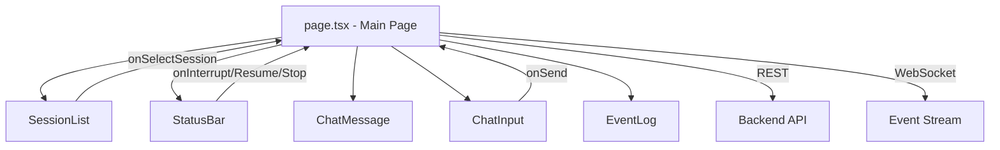

# Frontend

The frontend is a responsive Next.js 14 application that provides a real-time interface to Forge builds. It lives in `frontend/`.

## Tech Stack

| Technology | Version | Purpose |
|-----------|---------|---------|
| Next.js | 14.2+ | React framework with App Router |
| React | 18.3+ | UI library |
| TypeScript | 5.4+ | Type safety |
| Tailwind CSS | 3.4+ | Utility-first styling |
| PostCSS | 8.4+ | CSS processing |

## Project Structure

```
frontend/
├── app/
│   ├── globals.css          # Tailwind directives + custom styles
│   ├── layout.tsx           # Root layout (html, body, fonts)
│   ├── page.tsx             # Main page (chat + sidebar + events)
│   └── setup/
│       └── page.tsx         # 3-step Setup Wizard (API keys, model, sandbox mode)
├── components/
│   ├── ChatInput.tsx        # Message input with send button
│   ├── ChatMessage.tsx      # Individual message rendering
│   ├── ConnectionIndicator.tsx  # Health/connection status dot (healthy/degraded/unhealthy)
│   ├── ErrorPanel.tsx       # Slide-in panel listing all captured errors, filterable by category
│   ├── ErrorToast.tsx       # Auto-dismissing toast notifications for recoverable errors
│   ├── EventLog.tsx         # Real-time event stream panel
│   ├── SessionList.tsx      # Sidebar with session management
│   ├── SetupBanner.tsx      # Banner linking to /setup when health.configured is false
│   └── StatusBar.tsx        # Runtime status + control buttons
├── lib/
│   ├── api.ts               # API client (REST + WebSocket)
│   ├── error-store.ts       # Client-side error store (up to 200 entries, listener-based)
│   └── health.ts            # useHealthPolling hook — polls /health, tracks connection state
├── next.config.js          # Next.js configuration (API rewrites)
├── postcss.config.mjs      # PostCSS configuration (Tailwind plugin)
├── tailwind.config.ts      # Tailwind theme (forge-* colors)
├── tsconfig.json           # TypeScript configuration
└── package.json
```

## Component Architecture



### `page.tsx` — Main Page

The root page component manages all state:
- **Session state:** Active session, sidebar visibility
- **Chat state:** Message history, invoke status
- **Event state:** WebSocket connection, event log
- **Runtime state:** Polled status from backend

Layout: Three-panel responsive design:
- Left: Session sidebar (collapsible on mobile)
- Center: Chat messages + input
- Right: Event log (collapsible)

### `ChatInput.tsx`

Text input with send button. Disabled when no session is active or a build is in progress.

### `ChatMessage.tsx`

Renders user messages, system responses, and loading states. Exports the `Message` type:

```typescript
interface Message {
  id: string;
  role: "user" | "system";
  content: string;
  timestamp: Date;
  isLoading?: boolean;
  response?: InvokeResponse;
}
```

### `SessionList.tsx`

Sidebar showing all sessions with create/select/delete actions. Includes responsive mobile overlay.

### `EventLog.tsx`

Real-time scrolling log of `SessionEvent` objects received via WebSocket. Shows event type, source, and timestamp.

### `StatusBar.tsx`

Displays runtime status (current node, active task, budget) and control buttons (Interrupt, Resume, Stop).

### `ConnectionIndicator.tsx`

Small status dot + label reflecting backend connectivity. Derives a `healthy` / `degraded` / `unhealthy` state from the polled `HealthResponse` and the WebSocket connection flag — shows "Disconnected" if not connected or no health data is available yet.

### `ErrorPanel.tsx`

Slide-in side panel (backdrop + right-anchored drawer) listing all errors captured in the error store, with a category filter (`all`, `configuration`, `runtime`, `workflow`, `connection`). Each entry shows the error code, category, timestamp, message, and an optional suggestion.

### `ErrorToast.tsx`

Renders auto-dismissing toast notifications (top-right, max 5 visible, 8s auto-dismiss, paused on hover) for new errors that are marked `recoverable` in the error store. Shows an overflow count when more than 5 errors have queued.

### `SetupBanner.tsx`

Yellow banner rendered when the polled health response is missing, `configured` is `false`, or `status` is not `healthy`. Lists any unhealthy/degraded component names and links to `/setup` via a "Go to Setup" button.

### `app/setup/page.tsx` — Setup Wizard

A 3-step client-side wizard for first-run configuration:

1. **API Keys** — OpenRouter key (required) and GitHub token (optional), each with a "Test" button that calls `testConfigKey()` and shows latency/success or an error.
2. **Model Selection** — Loads available models via `getConfigModels()` and lets the user pick one from a dropdown.
3. **Sandbox Mode** — Choose `always` / `auto` / `never`, with a live Docker availability check (via `getHealth()` → `components.docker.status`) shown as a status dot.

On load, it pre-populates fields from `getConfig()` if a config already exists. Saving calls `updateConfig()` with the collected keys, model, and sandbox mode, then redirects to `/`.

## API Client

**File:** `frontend/lib/api.ts`

All backend communication goes through a single API client module.

### REST Endpoints

```typescript
// Sessions
listSessions(): Promise<Session[]>
createSession(payload: CreateSessionPayload): Promise<Session>
getSession(id: string): Promise<Session>
deleteSession(id: string): Promise<void>

// Workflow
invokeWorkflow(payload: InvokePayload): Promise<InvokeResponse>

// Inspection
getSessionStatus(id: string): Promise<RuntimeStatus>
getExplanation(id: string): Promise<DecisionExplanation>

// Control
interruptSession(id: string): Promise<{status: string}>
resumeSession(id: string): Promise<{status: string}>
stopSession(id: string): Promise<{status: string}>

// Config & Health (powers the Setup Wizard)
getConfig(): Promise<ConfigResponse>
updateConfig(payload: Partial<ConfigResponse>): Promise<ConfigResponse>
testConfigKey(component: string, key?: string): Promise<KeyTestResult>
getConfigHealth(): Promise<Record<string, ComponentHealth>>
getConfigModels(): Promise<{models: Array<{id: string; name: string}>}>
getHealth(): Promise<HealthResponse>
```

### Config & Health API

These endpoints back the Setup Wizard (`app/setup/page.tsx`) and the connection/health UI (`ConnectionIndicator`, `SetupBanner`, `useHealthPolling`):

- **`getConfig()`** — `GET /api/config`. Returns the current runtime config (`configured`, `openrouter_api_key`, `github_token`, `selected_model`, `sandbox_mode`), used to pre-populate the wizard on load.
- **`updateConfig(payload)`** — `PUT /api/config`. Persists a partial config update (e.g. API keys, selected model, sandbox mode) to the backend via `ConfigService`.
- **`testConfigKey(component, key)`** — `POST /api/config/test`. Tests a single credential (`"openrouter"` or `"github"`) without saving it, returning `{success, latency_ms, error?}`.
- **`getConfigHealth()`** — `GET /api/config/health`. Returns per-component health (`Record<string, ComponentHealth>`) for configuration-dependent components.
- **`getConfigModels()`** — `GET /api/config/models`. Returns the list of models available for selection in step 2 of the wizard.
- **`getHealth()`** — `GET /api/health` (no auth required). Returns overall `{status, configured, components}`, used both by the Setup Wizard's Docker check and by `useHealthPolling()` for the top-level connection indicator/banner.

### WebSocket Connection

```typescript
function connectEventStream(
  sessionId: string,
  onEvent: (event: SessionEvent) => void,
  onError?: (error: Event) => void,
  onClose?: () => void
): WebSocket
```

Connects to `ws://host/api/sessions/{id}/events` and parses incoming JSON messages as `SessionEvent` objects.

### Request Routing

All API calls go to `/api/*` which Next.js rewrites to `localhost:8000/*` (the backend). This avoids CORS issues in development.

## Responsive Design

The UI is fully responsive with three breakpoints:

| Breakpoint | Layout |
|-----------|--------|
| Mobile (<768px) | Sidebar as overlay, event log collapsed below chat |
| Tablet (768px+) | Fixed sidebar, event log toggle |
| Desktop (1024px+) | All three panels visible |

Key patterns:
- **Mobile sidebar:** Full-screen overlay with backdrop, toggled by hamburger menu
- **Event log:** Collapsible panel (bottom on mobile, right side on desktop)
- **Chat:** Always centered and visible, fills available space

## Custom Theme

Tailwind is extended with Forge-specific design tokens:

```css
/* Custom color tokens used throughout */
--forge-bg: ...       /* Background */
--forge-card: ...     /* Card backgrounds */
--forge-border: ...   /* Borders */
--forge-text: ...     /* Primary text */
--forge-muted: ...    /* Secondary text */
```

## How to Run

### Development

```bash
cd frontend
npm install
npm run dev
# Open http://localhost:3000
```

The dev server hot-reloads on file changes.

### Production Build

```bash
cd frontend
npm run build
npm start
```

### Linting

```bash
npm run lint
```

## How to Develop

### Adding a New Component

1. Create `frontend/components/YourComponent.tsx`
2. Use the `"use client"` directive if it uses hooks or browser APIs
3. Import and use in `page.tsx` or another component
4. Follow existing patterns: TypeScript props interface, Tailwind classes, responsive design

### Adding a New API Endpoint

1. Add types to `frontend/lib/api.ts`
2. Add the request function
3. Use it from a component with appropriate loading/error states

### State Management

The app uses React's built-in `useState` and `useEffect` — no external state library. State lives in `page.tsx` and is passed down as props. For a larger app, consider extracting to a context or state library.
